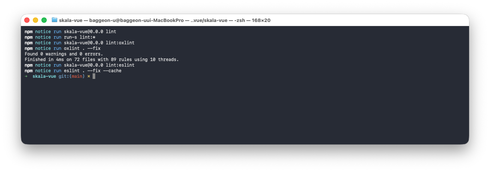

# skala-vue

Vue 3 수업에서 배운 문법을 하나의 날씨 조회 화면에 단계적으로 적용하는 과제 프로젝트입니다.

## 프로젝트 소개

- Vue 3의 Composition API와 `<script setup>`을 사용합니다.
- 배열 렌더링, 조건부 렌더링, 입력 바인딩과 이벤트 수식어를 날씨 목업에 적용합니다.
- `computed`, `watch`, `watchEffect`를 사용해 검색 결과와 등록 지역 날씨 요약을 관리합니다.
- 과제 1의 Weather Mockup을 과제 2의 Weather Composition으로 계속 발전시키는 구조입니다.

## 주요 기능

- OpenWeatherMap 기반 현재 날씨와 미세먼지 조회
- 국내 지역 검색, 날씨 카드 추가·갱신과 등록 카드 필터
- 국토교통부 OpenAPI 기반 시·도별 공식 시군구 코드 조회
- 등록 지역의 평균 기온·습도·풍속과 주요 지역 비교
- 섭씨·화씨 단위 전환과 지역별 상세 화면
- 현재 기상 조건에 따른 벌레 정보와 생활 팁 제공
- 검색 지역 상세 URL 새로고침 복구와 API 오류 재시도

## 프로젝트 구조

- 날씨 기능 컴포넌트는 `src/components/weather/`, 재사용 가능한 기본 컴포넌트는 `src/components/common/`에서 관리합니다.
- 날씨와 지역 상태는 `src/stores/`에서 관리하고, `/` 경로의 `WeatherHomeView.vue`가 화면 조립과 상세 페이지 이동을 담당합니다.
- 외부 API 요청 함수는 `src/apis/`, API별 Axios 인스턴스·인터셉터와 응답 변환 순수 함수는 `src/utils/`에서 관리합니다.
- 여러 파일에서 사용하는 숫자 기준은 `src/constants/`에서 API, 지역과 날씨 도메인별로 관리합니다.
- 사용자에게 표시하는 API 오류 문구와 동적 오류 메시지 생성 함수는 `src/messages/`에서 관리합니다.
- 외부 API에서 사용하는 Request와 Response DTO는 `src/dto/`에서 API별로 관리합니다.
- shadcn-vue의 생성 설정과 경로 별칭은 프로젝트 루트의 `components.json`에서 관리합니다.
- `src/App.vue`의 `RouterView`에서 현재 경로에 해당하는 View를 렌더링합니다.
- API 응답 전 초기 표시용 날씨 데이터는 `src/data/weatherData.js`, 기본 조회 도시와 좌표는 `src/data/cityData.js`에서 관리합니다.

```text
src/
├── App.vue
├── apis/
│   ├── geocoding.js
│   ├── regionalCode.js
│   └── weather.js
├── assets/
│   ├── eslint-terminal-result.png
│   ├── main.css
│   └── openweathermap-postman-api-test.png
├── components/
│   ├── common/
│   │   ├── BaseBadge.vue
│   │   ├── BaseButton.vue
│   │   └── BaseInput.vue
│   ├── region/
│   │   └── RegionalCodePanel.vue
│   ├── ui/
│   │   ├── alert/
│   │   ├── badge/
│   │   ├── button/
│   │   ├── card/
│   │   ├── checkbox/
│   │   ├── input/
│   │   ├── skeleton/
│   │   └── tooltip/
│   └── weather/
│       ├── CitySearchPanel.vue
│       ├── CitySelectionStatusPanel.vue
│       ├── ApiRequestStatus.vue
│       ├── DashboardCard.vue
│       ├── InsectConditionBadge.vue
│       ├── NationalWeatherPanel.vue
│       ├── UnitToggler.vue
│       ├── WeatherCard.vue
│       ├── WeatherCardList.vue
│       ├── WeatherHeader.vue
│       └── WeatherListFilter.vue
├── constants/
│   ├── api.js
│   ├── region.js
│   ├── storage.js
│   └── weather.js
├── data/
│   ├── cityData.js
│   ├── insectData.js
│   ├── provinceData.js
│   └── weatherData.js
├── dto/
│   ├── openWeatherGeocodingDto.js
│   ├── openWeatherDto.js
│   └── regionalCodeDto.js
├── lib/
│   └── utils.js
├── main.js
├── messages/
│   └── error.js
├── router/
│   └── index.js
├── stores/
│   ├── administrativeRegionStore.js
│   ├── configStore.js
│   ├── regionStore.js
│   └── weatherStore.js
├── types/
│   ├── insect.js
│   ├── region.js
│   ├── vue-shadcn.d.ts
│   └── weather.js
├── utils/
│   ├── airQuality.js
│   ├── insect.js
│   ├── openWeatherGeocodingClient.js
│   ├── openWeatherClient.js
│   ├── regionalCodeClient.js
│   ├── region.js
│   ├── regionalCode.js
│   ├── regionStorage.js
│   ├── temperature.js
│   └── weather.js
├── vite-env.d.ts
└── views/
    ├── NotFoundView.vue
    ├── RegionalCodeView.vue
    ├── WeatherAboutView.vue
    ├── WeatherDetailView.vue
    ├── WeatherHomeView.vue
    └── WeatherTipsView.vue
```

## UI와 디자인 시스템

- 실제 화면은 `src/components/ui/`의 shadcn-vue Button, Input, Badge, Card, Tooltip, Alert, Checkbox와 Skeleton을 조합합니다.
- `src/assets/main.css`에서 Tailwind CSS와 shadcn-vue Neutral 테마를 불러오고 배경, 글자, 카드, 테두리와 상태 색상을 semantic CSS 변수로 관리합니다.
- 화면의 레이아웃, 간격, 글자 크기와 반응형 배치는 Tailwind 유틸리티 클래스로 작성합니다.
- `success`, `warning` 상태 색상과 앱에 필요한 Badge 변형만 기본 테마에 추가했습니다.
- 과제 3에서 직접 만든 `BaseButton`, `BaseInput`, `BaseBadge`는 컴포넌트 설계 학습 기록으로 보존하며 현재 화면에서는 사용하지 않습니다.

## 실행 방법

### 의존성 설치

```sh
npm install
```

### 환경변수 설정

`.env.example`을 복사해 `.env`를 만들고 OpenWeatherMap과 공공데이터포털에서 발급받은 API Key를 입력합니다. OpenWeatherMap Key는 현재 날씨, 대기질과 지역 검색 요청에 사용하고 공공데이터포털 Key는 국토교통부 지역코드 요청에 사용하며, 실제 `.env`는 Git에 업로드되지 않습니다.

```sh
cp .env.example .env
```

### 개발 서버 실행

```sh
npm run dev
```

### 빌드

```sh
npm run build
```

### 코드 검사

```sh
npm run lint
npm run type-check
```

## 현재 배포 상태

Cloudflare Pages에 최신 코드를 배포하고 실제 API 동작까지 확인한 배포 정보입니다.

- 배포 주소: [https://homework.christmas](https://homework.christmas)
- 기본 Pages 주소: [https://skala-vue.pages.dev](https://skala-vue.pages.dev)
- GitHub 저장소: [https://github.com/pigpgw/skala-vue](https://github.com/pigpgw/skala-vue)
- 배포 서비스: Cloudflare Pages
- 도메인 구매 및 관리: Spaceship, Cloudflare DNS

### 배포 과정

1. GitHub의 `main` 브랜치에 Vue 소스코드를 푸시했습니다.
2. Cloudflare Pages에 GitHub 저장소를 연결했습니다.
3. 빌드 명령은 `npm run build`, 출력 폴더는 `dist`로 설정했습니다.
4. `dist/`는 GitHub에 직접 올리지 않고 Cloudflare Pages가 소스코드를 빌드하도록 구성했습니다.
5. Spaceship에서 구매한 `homework.christmas`의 네임서버를 Cloudflare 네임서버로 변경했습니다.
6. Cloudflare Pages에 사용자 도메인을 등록하여 배포 페이지와 연결했습니다.

## 과제 진행 기록

각 과제는 진행 상태와 요구사항을 공통 형식으로 표시하고, 필요한 경우 활용 준비와 추가 구현 및 리팩터링 기록을 구분합니다. 날짜 안에서는 실제 과제 진행 순서를 유지합니다. 각 작업의 관련 커밋은 작업 문장에 바로 연결했으며, 한 커밋에 여러 작업이 포함된 경우에는 작업별 코드 줄을 연결했습니다.

### 2026-08-19

과제 1과 과제 2의 반응형 날씨 기능은 현재 `/` 경로의 `WeatherHomeView.vue`에서 이어서 사용합니다.

#### 과제 1 - Weather Mockup

- 진행 상태: 구현 완료

**과제 요구사항**

- [x] `[과제 1-1 배열 렌더링 (v-for)]` 임의의 날씨 데이터 배열을 활용해 화면에 날씨 카드를 반복 출력하고, `:key`에 `id`를 바인딩했습니다. ([날씨 배열과 `v-for`·`:key` 구현](https://github.com/pigpgw/skala-vue/blob/5758c01/src/components/tasks/WeatherApp.vue#L5-L13))
- [x] `[과제 1-2 조건부 렌더링 (v-if)]` 기온이 25도 이상인 도시는 `🔥 더움 (25도 이상)`, 25도 미만인 도시는 `❄️ 선선함 (25도 미만)` 라벨을 표시하도록 조건부 렌더링을 적용했습니다. 조건은 과제 예시와 다르게 구성할 수 있다는 기준도 반영했습니다. ([`v-if`·`v-else` 구현](https://github.com/pigpgw/skala-vue/blob/7265147/src/components/tasks/WeatherApp.vue#L17-L18))
- [x] `[과제 1-3 양방향 바인딩 및 한글 처리 (:value, @input)]` 도시 이름을 한글로 검색하는 input을 만들고, 한글 입력 후 입력한 도시명을 화면에 출력했습니다. ([`:value`·`@input` 구현](https://github.com/pigpgw/skala-vue/blob/991fdbe/src/components/tasks/WeatherApp.vue#L6-L16))
- [x] `[과제 1-4 이벤트 및 수식어]` 지역별 날씨 현황 카드를 누르면 상태바에 “`{도시}이 선택되었습니다.`”를 표시하고, 카드 내부의 `[상세보기]` 버튼은 버블링 없이 해당 도시의 날씨 내용을 `window.alert`로 표시하도록 구현했습니다. ([카드 선택·`@click.stop`·상세보기 구현](https://github.com/pigpgw/skala-vue/blob/d37365e/src/components/tasks/WeatherApp.vue#L32-L40))
- [x] `[과제 1-5 본인만의 데이터와 Mockup 확장]` 본인만의 날씨 데이터를 추가하고, 제주·습도·풍속·미세먼지·도시 검색과 최소 테두리를 반영해 Mockup을 확장했습니다. ([추가 날씨 데이터](https://github.com/pigpgw/skala-vue/blob/888f978/src/data/weatherData.js#L1-L6))

#### 과제 2 - Weather Composition

- 진행 상태: 구현 완료

**과제 요구사항**

- [x] `[과제 2-1 반응형 상태 관리]` 검색어(`searchQuery`), 선택된 도시(`selectedCityInfo`), 지역별 날씨 데이터 배열(`weatherList`)을 반응형 상태로 정의했습니다. (1일차와 동일한 상태 구성을 유지했습니다.) ([반응형 상태 정의](https://github.com/pigpgw/skala-vue/blob/87fb351/src/components/tasks/WeatherApp.vue#L5-L7))
- [x] `[과제 2-2 검색 도시 (computed 활용)]` 전체 날씨 리스트에서 사용자가 입력한 검색어가 도시 이름에 포함된 항목만 필터링해 `computed` 배열 `filteredWeatherList`에 담았습니다. ([`filteredWeatherList` 구현](https://github.com/pigpgw/skala-vue/blob/188c90d/src/components/tasks/WeatherApp.vue#L5-L9))
- [x] `[과제 2-3 반응형 변수 변화 감시 (watch, watchEffect)]` `selectedCityInfo`는 `watch`로 감시해 상태바 문구가 바뀔 때마다 콘솔 로그를 작성하고, `searchQuery`는 `watchEffect`로 추적해 도시 검색어를 타이핑할 때마다 콘솔 로그를 작성했습니다. ([`watch`·`watchEffect` 구현](https://github.com/pigpgw/skala-vue/blob/9b56d18/src/components/tasks/WeatherApp.vue#L13-L17))
- [x] `[과제 2-4 검색 결과 표시]` 검색어가 비었을 때는 원본 데이터를 출력하고, 검색어와 일치하는 데이터가 있을 때는 해당 데이터를 출력하며, 일치하는 데이터가 없을 때는 “검색 결과가 일치하는 도시가 없습니다.”라고 안내했습니다. ([검색 결과 조건부 표시](https://github.com/pigpgw/skala-vue/blob/bcff979/src/components/tasks/WeatherApp.vue#L35-L59))
- [x] `[과제 2-5 반응형 로직 확장]` 본인만의 반응형 상태 변수와 `computed`, watcher를 추가해 검색 결과 개수와 전국 평균 기온을 계산하고 변화를 감시했습니다. ([추가 `computed`·`watch` 구현](https://github.com/pigpgw/skala-vue/blob/1cdedfb/src/components/tasks/WeatherApp.vue#L10-L19))
- [x] `[과제 2-5]` [전국 평균 기온](https://github.com/pigpgw/skala-vue/blob/f55c6a7/src/components/tasks/WeatherApp.vue#L11), [습도](https://github.com/pigpgw/skala-vue/blob/b85f213/src/components/tasks/WeatherApp.vue#L17), [풍속](https://github.com/pigpgw/skala-vue/blob/8f6d7a4/src/components/tasks/WeatherApp.vue#L18)을 `computed`로 계산하고 `watch`로 변화를 감시했습니다.
- [x] `[과제 2-5]` [미세먼지 나쁨 도시 개수를 `computed`로 계산하고 `watch`로 변화를 감시했습니다.](https://github.com/pigpgw/skala-vue/blob/c2580f2/src/components/tasks/WeatherApp.vue#L14-L35)
- [x] `[과제 2-5]` [가장 덥고](https://github.com/pigpgw/skala-vue/blob/3b572d2/src/components/tasks/WeatherApp.vue#L17) [추우며](https://github.com/pigpgw/skala-vue/blob/9372034/src/components/tasks/WeatherApp.vue#L17) [습하고](https://github.com/pigpgw/skala-vue/blob/8e48fad/src/components/tasks/WeatherApp.vue#L17) [풍속이 강한 도시](https://github.com/pigpgw/skala-vue/blob/0cef2ee/src/components/tasks/WeatherApp.vue#L18)를 `computed`와 `reduce()`로 찾았습니다.
- [x] `[과제 2-5]` [`ref`, `v-model`, `v-show`로 전국 통계 표시 여부를 제어하고 `watch`로 변화를 감시했습니다.](https://github.com/pigpgw/skala-vue/blob/62a3eeb/src/components/tasks/WeatherApp.vue#L8-L23)
- [x] `[과제 2-5]` [검색어와 검색 결과 개수를 `computed`로 조합해 검색 상태 문구를 만들고 `watch`로 변화를 감시했습니다.](https://github.com/pigpgw/skala-vue/blob/5ff63bf/src/components/tasks/WeatherApp.vue#L22-L26)

### 2026-08-20

#### 과제 3 - Hands on: Weather Component Vue Components

- 진행 상태: 구현 완료

**과제 요구사항**

- [x] `[과제 3-1 WeatherParent.vue]` 기능 변경 없이 `WeatherParent.vue`를 부모 컴포넌트로 분리하고, 모든 반응형 데이터와 계산·감시 로직을 유지했습니다. ([`WeatherParent.vue` 분리](https://github.com/pigpgw/skala-vue/blob/486c7b2/src/components/tasks/WeatherParent.vue#L5-L39))
- [x] `[과제 3-2 BaseDashboardCard.vue]` 검색 박스와 리스트 박스의 디자인을 공통화하고, `<slot>`을 배치해 부모 컴포넌트가 도시 검색과 날씨 현황을 주입할 수 있도록 구성했습니다. ([공통 카드와 `<slot>`](https://github.com/pigpgw/skala-vue/blob/1c8d188/src/components/tasks/BaseDashboardCard.vue#L1-L14))
- [x] `[과제 3-3 SearchBar.vue]` 부모로부터 검색 도시 반응형 데이터를 props로 전달받아 표시하고, 도시 검색 시 `update-query` 이벤트를 발생시켜 검색어를 부모 `WeatherParent.vue`에 전달했습니다. ([props·`update-query` emits](https://github.com/pigpgw/skala-vue/blob/d77c574/src/components/tasks/SearchBar.vue#L2-L22))
- [x] `[과제 3-4 WeatherCard.vue]` 선택된 도시 객체를 props로 전달받아 표시하고, 카드 선택은 `select-card` 이벤트로, 상세보기는 `click-detail` 이벤트로 부모에게 전달했습니다. ([props](https://github.com/pigpgw/skala-vue/blob/8f6e77e/src/components/tasks/WeatherCard.vue#L15-L20), [`select-card`](https://github.com/pigpgw/skala-vue/blob/8f6e77e/src/components/tasks/WeatherCard.vue#L24), [`click-detail`](https://github.com/pigpgw/skala-vue/blob/8f6e77e/src/components/tasks/WeatherCard.vue#L39))
- [x] `[과제 3-5·3-6 디자인과 통신]` 각 컴포넌트의 디자인을 `<style scoped>`로 분리하고, Slot으로 전달되는 `SearchBar`와 `WeatherCard`는 시각적으로는 `BaseDashboardCard` 내부에 위치하지만 스크립트상 부모 컴포넌트의 스코프에서 컴파일·평가되므로 `WeatherParent.vue`에서 props와 emits를 직접 바인딩하고 통신하도록 구성했습니다. ([컴포넌트별 scoped CSS](https://github.com/pigpgw/skala-vue/blob/12a25ec/src/components/tasks/SearchBar.vue#L25-L29), [부모의 Slot·이벤트 바인딩](https://github.com/pigpgw/skala-vue/blob/fc2abcf/src/components/tasks/WeatherParent.vue#L55-L90))
- [x] `[과제 3-7 추가 컴포넌트]` 본인의 Mockup에서 날씨 카드 목록, 전국 날씨 통계와 검색 패널을 추가 컴포넌트로 분리해 기능별 책임을 확장했습니다. ([`refactor: [과제 3-7] 날씨 카드 목록 컴포넌트를 분리`](https://github.com/pigpgw/skala-vue/commit/10fb7ec))

**추가 구현 및 리팩터링**

- `[과제 3-7 추가 컴포넌트]` 이후 날씨 카드의 반복 렌더링과 이벤트 전달을 `WeatherCardList.vue`로 추가 분리하고 기존 기능이 유지되도록 구성했습니다. ([`refactor: [과제 3-7] 날씨 카드 목록 컴포넌트를 분리`](https://github.com/pigpgw/skala-vue/commit/10fb7ec))
- `[과제 3-7 추가 컴포넌트]` 추가로 전국 날씨 통계 영역을 `NationalWeatherSummary.vue`로 분리하고 부모가 계산한 통계를 props로 전달받아 표시하도록 구성했습니다. ([`refactor: [과제 3-7] 전국 날씨 요약 컴포넌트를 분리`](https://github.com/pigpgw/skala-vue/commit/1c5c8c7))
- `[과제 3-7 추가 컴포넌트]` 검색 입력과 결과 안내의 추상화 계층을 맞추기 위해 `SearchBar.vue`를 `SearchPanel.vue`로 확장했습니다. 검색어, 결과 개수와 검색 상태를 props로 전달받아 표시하고, 입력 시 `update-query` 이벤트로 변경된 검색어를 부모에 전달하도록 구성했습니다. ([`refactor: [과제 3-7] 검색바를 검색 패널로 확장`](https://github.com/pigpgw/skala-vue/commit/425836f))
- `[과제 3-7 추가 리팩터링]` 전국 통계 보기 체크박스를 해당 책임을 가진 `NationalWeatherSummary.vue`로 이동했습니다. `showNationalSummary` 상태는 부모에 유지하고, 자식은 변경된 체크값을 `update-show-national-summary` 이벤트로 전달하도록 구성했습니다. ([`refactor: [과제 3-7] 전국 통계 제어를 요약 컴포넌트로 이동`](https://github.com/pigpgw/skala-vue/commit/40c63de))
- `[과제 3-7 추가 리팩터링]` 검색 영역과 날씨 목록을 각각 `SearchPanel.vue`와 `WeatherCardList.vue`가 직접 담당하도록 변경했습니다. 각 영역의 독립적인 책임과 단순한 컴포넌트 구조가 더 적합하다고 판단해 공통 Slot 래퍼였던 `BaseDashboardCard.vue`를 제거했습니다. ([`refactor: [과제 3-7] 공통 대시보드 래퍼를 제거`](https://github.com/pigpgw/skala-vue/commit/67bee31))
- `[과제 3-7 추가 리팩터링]` 검색, 전국 통계와 날씨 목록 세 영역에 동일한 박스 디자인이 필요해 `BaseDashboardCard.vue`를 공용 Slot 컴포넌트로 다시 적용했습니다. 공통 디자인은 래퍼가 담당하고 내부 컴포넌트는 각 기능에 집중하도록 구성했습니다. ([`refactor: [과제 3-6] 공용 대시보드 카드를 다시 적용`](https://github.com/pigpgw/skala-vue/commit/fc2abcf))
- `[과제 3-7 추가 컴포넌트]` 애플리케이션 제목을 `WeatherHeader.vue`로 분리하고, 전체 화면 골격을 담당하는 `App.vue`에 Header와 `<main>`을 배치했습니다. `WeatherParent.vue`는 검색, 통계와 목록 기능에 집중하도록 변경했으며 표시할 내용이 없는 Footer는 만들지 않았습니다. ([`refactor: [과제 3-7] 날씨 앱 헤더와 본문 구조를 분리`](https://github.com/pigpgw/skala-vue/commit/e79ff40))
- `[과제 3-7 구조 및 네이밍 리팩터링]` 선택 결과 영역을 `CitySelectionStatusPanel.vue`로 분리해 `DashboardCard`를 적용하고, 검색 결과 없음 문구는 목록 상태를 담당하는 `WeatherCardList.vue`로 이동했습니다. 화면과 도메인 역할이 드러나도록 `WeatherParent`를 `WeatherDashboard`, `BaseDashboardCard`를 `DashboardCard`, `SearchPanel`을 `CitySearchPanel`, `NationalWeatherSummary`를 `NationalWeatherPanel`로 변경했으며 상태, props, 함수와 CSS 클래스 이름도 함께 정리했습니다. 과제에서 지정한 이벤트 이름은 유지하고 README 파일 트리를 최종 컴포넌트 구조에 맞게 갱신했습니다. ([`refactor: [과제 3-7] 날씨 대시보드 구조와 네이밍을 정리`](https://github.com/pigpgw/skala-vue/commit/2b5ad67))
- `[과제 3-7 코드 스타일 정리]` 함수의 매개변수 타입만 설명하는 짧은 JSDoc은 한 줄 형식으로 통일했습니다. 여러 속성을 설명해야 하는 `WeatherItem` 타입 정의는 가독성을 위해 여러 줄 형식을 유지했습니다. ([`style: [과제 3-7] 함수 JSDoc을 한 줄 형식으로 정리`](https://github.com/pigpgw/skala-vue/commit/5817a2c))
- `[과제 3-7 임포트 경로 정리]` Vite와 `jsconfig.json`에 설정된 `@` 별칭을 사용해 `App.vue`와 `src/components/weather`의 과제 코드 임포트를 절대 경로로 통일했습니다. 임포트는 외부 패키지와 내부 모듈 사이를 한 줄 띄우고, 같은 그룹 안에서는 이름순으로 정리했습니다. ([`refactor: [과제 3-7] 과제 컴포넌트 임포트를 절대 경로로 통일`](https://github.com/pigpgw/skala-vue/commit/76f88b9))
- `[과제 3-7 코드 구조 정리]` 과제 컴포넌트의 선언 순서를 임포트, props/emits, 원본 반응형 상태, 파생 상태, 이벤트 함수, watch/watchEffect 순으로 통일했습니다. 같은 종류의 선언은 글자 길이가 아니라 데이터 의존 관계와 화면의 검색, 전국 통계, 선택 결과 흐름에 맞춰 배치했습니다. ([`refactor: [과제 3-7] 과제 코드 선언 순서를 역할별로 정리`](https://github.com/pigpgw/skala-vue/commit/5f2f016))
- `[과제 3-5 보완]` 기본 팔레트, 역할별 색상과 상태별 그림자를 `main.css`의 CSS 변수로 분리해 컴포넌트 디자인의 공통 기준을 구성했습니다. ([`style: [과제 3-5] 공용 색상 토큰을 설정`](https://github.com/pigpgw/skala-vue/commit/5d84f34))
- `[과제 3-7 추가 공용 컴포넌트]` 반복되는 버튼 디자인을 `src/components/common/BaseButton.vue`로 분리하고 단위 변경과 날씨 상세보기 버튼에 적용했습니다. ([`feat: [과제 3-7] 공용 버튼 컴포넌트를 추가`](https://github.com/pigpgw/skala-vue/commit/a4a44de))
  - `variant`는 `primary`, `success`, `warning`, `danger`를 지원합니다.
  - `size`는 `small`, `medium`, `large`를 지원합니다.
  - 기본값은 `variant="primary"`, `size="medium"`입니다.
  - 네이티브 `click` 이벤트를 명시적으로 선언해 부모 컴포넌트에 전달합니다.
  - 호버, 클릭, 키보드 포커스와 비활성 상태 스타일을 제공합니다.
- `[과제 3-5 디자인 토큰 확장]` 폰트 크기, 글자 굵기, 간격, 모서리와 일반 그림자를 전역 CSS 변수로 추가하고 현재 날씨 컴포넌트에 적용했습니다. ([`style: [과제 3-5] 디자인 토큰을 확장`](https://github.com/pigpgw/skala-vue/commit/1d4d412))
- `[과제 3-7 추가 공용 입력 컴포넌트]` `BaseInput.vue`를 별도 공용 컴포넌트로 추가하고 `CitySearchPanel.vue`의 검색 입력창에 적용했습니다. ([`feat: [과제 3-7] 공용 입력 컴포넌트를 추가`](https://github.com/pigpgw/skala-vue/commit/dcef066))
  - `variant`와 `size`에 따라 공용 색상 및 크기 토큰을 사용합니다.
  - `type`, `value`, `placeholder`를 props로 받고 나머지 네이티브 속성은 `$attrs`로 전달합니다.
  - 검색 입력창의 너비는 부모 래퍼에서 조절하고 `input` 이벤트를 명시적으로 부모에 전달합니다.
- `[과제 3-7 추가 공용 배지 컴포넌트]` `BaseBadge.vue`를 추가하고 날씨 카드의 현재 날씨와 미세먼지 상태 표시에 적용했습니다. ([`feat: [과제 3-7] 공용 배지 컴포넌트를 추가`](https://github.com/pigpgw/skala-vue/commit/33c66c0))
  - `variant`와 `size` 기본값을 제공하고 공용 색상, 폰트, 간격과 모서리 토큰을 사용합니다.
  - 미세먼지 좋음, 보통, 나쁨 상태를 각각 `success`, `warning`, `danger` 색상으로 구분합니다.

### 2026-08-21

#### 과제 4 - Hands on: Weather Router Vue Router

- 진행 상태: 구현 완료

**과제 요구사항**

과제에서 제시한 기본 프로젝트 폴더 구조는 다음과 같습니다. 이후 과제 진행 과정에서 `exercise/`의 실습 컴포넌트는 `components/weather/`와 `components/common/`으로 정리했습니다.

```text
src/
├── main.js                  # 라우터 인스턴스 전역 주입 (.use(router))
├── App.vue                  # 내비게이션 바 (RouterLink)와 RouterView 배치
├── router/
│   └── index.js              # routes 배열과 Lazy Loading 설정
├── components/
│   └── exercise/             # 실습용 부품 컴포넌트 격리 폴더
│       ├── BaseDashboardCard.vue
│       ├── SearchBar.vue
│       └── WeatherCard.vue
└── views/                    # 페이지 단위 컴포넌트
    ├── WeatherHomeView.vue
    ├── WeatherAboutView.vue
    ├── WeatherDetailView.vue
    └── NotFoundView.vue
```

- [x] `[과제 4-1 Vue Router 설정]` 라우터의 `routes` 배열을 정의하고, 메인 화면을 제외한 View에는 지연 로딩을 적용했으며 정의되지 않은 경로에는 Catch-all Route를 적용했습니다. `main.js`에서는 라우터 인스턴스를 `.use(router)`로 전역 주입했습니다. ([라우터 설정과 Lazy Loading·Catch-all](https://github.com/pigpgw/skala-vue/blob/c2f0077/src/router/index.js#L5-L30), [라우터 전역 주입](https://github.com/pigpgw/skala-vue/blob/c2f0077/src/main.js#L1-L8))
- [x] `[과제 4-2 App.vue]` `App.vue`에 `RouterLink`를 이용한 Navigation Bar를 추가하고, 메인 콘텐츠 영역에 현재 경로의 View를 표시하는 `RouterView`를 배치했습니다. ([Navigation Bar와 RouterView](https://github.com/pigpgw/skala-vue/blob/bd6bc46/src/App.vue#L7-L15))
- [x] `[과제 4-3 WeatherHomeView.vue]` `WeatherParent`를 대체해 과제 3의 반응형 상태와 화면 조립을 `/` 경로의 `WeatherHomeView.vue`로 이동했습니다. 상세보기 버튼의 `window.alert()`는 제거하고 `useRouter()`와 `router.push('/weather/' + id)`를 사용한 Programmatic Navigation으로 변경했습니다. ([WeatherHomeView와 상세 이동](https://github.com/pigpgw/skala-vue/blob/9ed6e06/src/views/WeatherHomeView.vue#L7-L43))
- [x] `[과제 4-4 WeatherDetailView.vue]` `WeatherDetailView.vue`에서 지역별 상세 기상관측 정보를 보여주고, 도시 코드에 해당하는 Mock Data를 임시로 활용했습니다. Router의 동적 경로에 매칭된 `cityId`를 기준으로 Mount 시점에 Mock Data에서 도시 객체를 선택했습니다. ([동적 상세 페이지와 Mock Data](https://github.com/pigpgw/skala-vue/blob/9ed6e06/src/views/WeatherDetailView.vue#L7-L31))
- [x] `[과제 4-5 WeatherAboutView.vue]` `WeatherAboutView.vue`에 날씨 서비스의 적당한 내용을 작성하고, `RouterLink`로 메인 대시보드에 돌아가는 기능을 구현했습니다. ([소개 페이지와 메인 이동](https://github.com/pigpgw/skala-vue/blob/283b798/src/views/WeatherAboutView.vue#L5-L17))
- [x] `[과제 4-6 추가 View]` 정의된 View 이외에 `WeatherTipsView.vue`를 추가하고 `/tips` 경로와 Navigation Bar를 연결해 날씨별 생활 수칙을 안내하도록 Routing했습니다. ([추가 View](https://github.com/pigpgw/skala-vue/blob/c9f7a99/src/views/WeatherTipsView.vue#L5-L16), [추가 Route](https://github.com/pigpgw/skala-vue/blob/c9f7a99/src/router/index.js#L17-L20))

**추가 구현 및 리팩터링**

- `[과제 4-2 반응형 내비게이션 보완]` 작은 화면에서 내비게이션 링크와 단위 변경 버튼 문구가 두 줄로 나뉘지 않도록 한 줄 표시를 적용했습니다. ([`style: [과제 4-2] 내비게이션 줄바꿈을 방지`](https://github.com/pigpgw/skala-vue/commit/1616ab7))
  - 내비게이션 전역 레이아웃은 `main.css`에서 관리하며 화면 너비보다 길어지면 항목을 축소하거나 줄바꿈하지 않고 가로로 스크롤할 수 있도록 구성했습니다.

#### 과제 5 - Hands on: Weather Store Pinia

- 진행 상태: 구현 완료

**과제 요구사항**

- [x] `[과제 5-0 configStore.js]` 날씨 단위를 세팅하는 `stores/configStore.js`를 작성했습니다. `state`의 `unit`에 현재 단위를 저장하고 초기값은 `celsius`로 설정했으며, `getters`의 `unitSymbol`은 현재 단위에 맞는 `℃` 또는 `℉` 기호를 반환하고, `actions`의 `toggleUnit`은 `celsius`와 `fahrenheit`를 토글합니다. ([`configStore.js` 구현](https://github.com/pigpgw/skala-vue/blob/9d89714/src/stores/configStore.js#L4-L19))
- [x] `[과제 5-1 UnitToggler.vue]` 대시보드 상단에 현재 단위와 단위 기호를 표시하고 `toggleUnit`을 실행하는 UI 버튼과 영역을 `UnitToggler.vue`로 작성했습니다. ([`UnitToggler.vue` 구현](https://github.com/pigpgw/skala-vue/blob/80a2d68/src/components/tasks/UnitToggler.vue#L1-L11))
- [x] `[과제 5-2 Navigation Bar 배치]` `UnitToggler.vue`를 `App.vue`의 Navigation Bar 옆에 배치했습니다. ([Navigation Bar 배치](https://github.com/pigpgw/skala-vue/blob/f687207/src/App.vue#L8-L20))
- [x] `[과제 5-3 메인·상세 단위 적용]` 메인 날씨와 상세 날씨에 단위 설정 변경을 적용했습니다. 기본 원본 데이터는 섭씨 숫자로 유지하고, 현재 단위가 `fahrenheit`이면 `Math.round((rawTemp * 9) / 5 + 32)`로 변환하며, `celsius`일 때는 원본 값을 그대로 반환합니다. 현재 단위에 맞는 `unitSymbol`도 함께 표시합니다. ([메인 카드·통계](https://github.com/pigpgw/skala-vue/blob/c5d1776/src/components/tasks/WeatherCard.vue#L27-L46), [상세 화면](https://github.com/pigpgw/skala-vue/blob/c5d1776/src/views/WeatherDetailView.vue#L12-L32))
- [x] `[과제 5-4 추가 Store]` 메인과 상세 날씨에서 단위 설정 외에 공유할 상태를 관리하기 위해 `weatherStore.js`를 직접 작성하고 실제로 활용했습니다. 과제에서 제시한 Composable 해결 방법은 범위에서 제외하고 Store 방식으로 구성했습니다. ([`weatherStore.js` 구현](https://github.com/pigpgw/skala-vue/blob/cc0dcaa/src/stores/weatherStore.js#L17-L34))
  - `state` 역할의 `weatherList`에 메인과 상세 화면이 공유하는 날씨 데이터를 저장했습니다.
  - `action` 역할의 `addWeatherItem`으로 새 날씨 데이터를 추가하고 `findWeatherById`로 도시 ID에 해당하는 날씨를 조회하도록 구성했습니다.
  - `WeatherHomeView.vue`에서는 `storeToRefs`로 `weatherList`의 반응성을 유지하면서 카드 목록과 전국 통계에 사용했습니다.
  - `WeatherDetailView.vue`에서는 `findWeatherById`를 호출해 동적 경로의 도시 ID에 해당하는 상세 날씨를 조회했습니다.
  - 검색어와 필터링은 메인 화면에서만 사용하므로 전역 Store로 이동하지 않고 `WeatherHomeView.vue`의 지역 상태와 계산된 값으로 유지했습니다.

**추가 구현 및 리팩터링**

- `[과제 5-3 온도 변환 리팩터링]` 컴포넌트마다 중복된 섭씨·화씨 변환 공식을 `src/utils/temperature.js`의 순수 함수로 분리했습니다. ([`refactor: [과제 5-3] 온도 변환 함수를 분리`](https://github.com/pigpgw/skala-vue/commit/6e2c159))
  - `WeatherCard`, `NationalWeatherPanel`, `WeatherDetailView`에서 온도와 현재 단위를 인자로 전달해 동일한 변환 함수를 사용합니다.
  - 단위 Store를 utils에서 직접 참조하지 않아 변환 함수를 독립적으로 재사용하고 검증할 수 있도록 구성했습니다.
- `[과제 5-4 공용 타입 리팩터링]` 세 파일에 중복 선언된 `WeatherItem` JSDoc 타입을 `src/types/weather.js`로 분리했습니다. ([`refactor: [과제 5-4] 공용 날씨 타입을 분리`](https://github.com/pigpgw/skala-vue/commit/4b306f8))
  - `weatherStore`, `WeatherCard`, `WeatherCardList`가 하나의 날씨 데이터 구조를 참조하도록 통일했습니다.
  - README 파일 트리에 공용 컴포넌트, 타입과 utils 디렉터리를 반영했습니다.
- `[과제 5-4 날씨별 벌레 정보 확장]` 날씨 Mock Data에 도시별 `insects` 목록을 추가하고 날씨 카드와 상세 화면에서 자주 출몰하는 벌레를 표시했습니다. ([`feat: [과제 5-4] 날씨별 벌레 정보를 추가`](https://github.com/pigpgw/skala-vue/commit/1d74b03))
  - 모기, 러브버그, 초파리, 매미, 잠자리, 나방과 쯔쯔가무시를 매개하는 털진드기 정보를 포함합니다.
  - 벌레 목록은 공용 `BaseBadge`로 표시하고 털진드기 주의 정보는 `danger`, 나머지는 `warning` 색상으로 구분합니다.
  - 두 화면에서 사용하는 벌레 위험도 판별은 `src/utils/insect.js`의 공용 함수로 분리했습니다.
- `[과제 5-4 벌레 정보 구조 및 안내 기능 확장]` `insects`를 문자열 배열에서 `id`, `name`, `condition`, `sideEffects`를 가진 객체 배열로 변경했습니다. ([`feat: [과제 5-4] 벌레 정보 안내 기능을 확장`](https://github.com/pigpgw/skala-vue/commit/d65e7a2))
  - 공용 벌레 정보는 `insectData.js`, 타입은 `types/insect.js`에서 관리해 새 벌레를 한 곳에서 쉽게 추가할 수 있도록 구성했습니다.
  - `InsectConditionBadge.vue`를 추가해 벌레 배지에 마우스를 올리거나 키보드로 포커스하면 출몰 조건과 영향을 확인할 수 있도록 했습니다.

#### 공통 프로젝트 정리

- [`[과제 제출 파일 구조 정리]` 현재 과제에서 사용하는 파일만 남기고 Vue 기본 예제, 수업 연습본, 자동 생성본과 단계별 백업 파일을 제거했습니다.](https://github.com/pigpgw/skala-vue/commit/898a74c)
  - `tasks` 폴더를 없애고 기능 컴포넌트는 `components/weather`, 공용 Base 컴포넌트는 `components/common`으로 역할에 맞게 분리했습니다.
  - 실행에 필요한 프로젝트 설정과 날씨 View, 데이터, Store, 타입 및 utils 구조는 그대로 유지했습니다.

#### 과제 6 - Hands on: Weather Axios

- 진행 상태: 구현 완료 (`6-1`, `6-2`, `6-3` 완료)

**활용 준비**

- [x] `[Axios 활용 준비 1]` Axios 라이브러리를 설치했습니다. ([Axios 의존성 설정](https://github.com/pigpgw/skala-vue/blob/29ca885/package.json#L15-L20))
- [x] `[Axios 활용 준비 2]` OpenWeatherMap에 가입하고 API Key를 발급받아 환경변수로 관리할 준비를 했습니다. ([OpenWeatherMap 가입·Key 발급 기록](https://github.com/pigpgw/skala-vue/blob/29ca885/README.md#L302-L307))
- [x] [API Key가 커밋되지 않도록 `.env`를 `.gitignore`에 추가했습니다.](https://github.com/pigpgw/skala-vue/commit/dc16b6c)
- [x] [OpenWeatherMap 전용 Axios 인스턴스와 요청·응답 인터셉터를 구성했습니다.](https://github.com/pigpgw/skala-vue/blob/a6eb3d1/src/utils/openWeatherClient.js#L1-L42)
- [x] [위도·경도 및 도시명 기반 현재 날씨 조회 함수를 준비했습니다.](https://github.com/pigpgw/skala-vue/blob/a6eb3d1/src/apis/weather.js#L3-L23)
- [x] `[과제 6-3 준비]` [국토교통부 지역코드 API 전용 Axios 인스턴스와 요청·응답 인터셉터를 구성했습니다.](https://github.com/pigpgw/skala-vue/commit/c638145)
- [x] `[과제 6-3 준비]` [페이지와 시도 코드를 전달할 수 있는 지역코드 조회 함수를 API 모듈로 분리했습니다.](https://github.com/pigpgw/skala-vue/commit/464d91d)
- [x] `[과제 6-3 준비]` [지역코드 원본 응답과 검색용 지역 객체의 JSDoc 타입을 분리했습니다.](https://github.com/pigpgw/skala-vue/commit/a6d87cb)
- [x] `[과제 6-3 준비]` [`regionStore`에서 지역 목록을 관리하고 시군구 코드 기준으로 중복을 제거했습니다.](https://github.com/pigpgw/skala-vue/commit/0d06dd0)
- [x] `[과제 6-3 준비]` [`CitySearchPanel`에 지역 검색 결과 목록과 지역 선택 이벤트를 추가했습니다.](https://github.com/pigpgw/skala-vue/commit/3bed0ed)

**과제 요구사항**

- [x] `[과제 6-1 실제 날씨 API 적용]` OpenWeatherMap API를 통해 실제 날씨 데이터를 가져와 애플리케이션에 적용했습니다. ([날씨 조회와 Store 반영](https://github.com/pigpgw/skala-vue/blob/b2e985b/src/stores/weatherStore.js#L24-L53))
- [x] `[과제 6-2 OpenWeatherMap API 확장]` OpenWeatherMap에서 제공되는 Air Pollution API를 추가해 미세먼지 기능으로 애플리케이션을 확장했습니다. ([Air Pollution API](https://github.com/pigpgw/skala-vue/blob/7b3c3ab/src/apis/weather.js#L31-L44), [Store 반영](https://github.com/pigpgw/skala-vue/blob/7b3c3ab/src/stores/weatherStore.js#L26-L53))
- [x] `[과제 6-3 기타 외부 API 확장]` 국토교통부 지역코드 OpenAPI를 추가해 조회된 시군구의 검색 기능으로 애플리케이션을 확장했습니다. ([지역코드 API](https://github.com/pigpgw/skala-vue/blob/33a1581/src/apis/regionalCode.js#L7-L20), [조회 화면](https://github.com/pigpgw/skala-vue/blob/fcf0417/src/components/region/RegionalCodePanel.vue#L43-L86))

**구현 기록**

- [x] `[과제 6-3]` [`WeatherHomeView`에서 지역 데이터를 조회하고 입력한 지역명과 일치하는 검색 후보를 최대 10개까지 표시했습니다.](https://github.com/pigpgw/skala-vue/commit/a05eed1)
- [x] `[과제 6-3 UI 보완]` [지역 검색 결과를 공용 `BaseButton` 세로 목록으로 표시하고, 전체 화면은 좁은 단일 칼럼으로 구성해 입력창과 결과 목록을 카드 왼쪽 기준선에 정렬했습니다.](https://github.com/pigpgw/skala-vue/commit/fc00df5)
- [x] `[과제 6-1 준비]` [메인에 표시할 서울·수원·부산·제주의 이름과 위도·경도를 `cityData.js`에 분리했습니다.](https://github.com/pigpgw/skala-vue/commit/99ab3e2)
- [x] `[과제 6-1 준비]` [OpenWeatherMap 현재 날씨 응답 구조를 공용 JSDoc 타입으로 분리하고 날씨 조회 함수의 반환 타입에 적용했습니다.](https://github.com/pigpgw/skala-vue/commit/cb365b8)
- [x] `[과제 6-1 준비]` [`weatherStore`에서 기본 도시의 현재 날씨를 병렬 조회하고 기존 카드 데이터 구조로 변환하는 비동기 액션을 작성했습니다.](https://github.com/pigpgw/skala-vue/blob/b2e985b/src/stores/weatherStore.js#L24-L53)
- [x] `[과제 6-1]` [메인 화면 Mount 시 서울·수원·부산·제주의 현재 날씨를 조회해 카드와 전국 통계의 기온, 날씨 상태, 습도와 풍속에 실제 API 데이터를 적용했습니다.](https://github.com/pigpgw/skala-vue/commit/3043709)
- [x] `[과제 6-3 보완]` [초기 지역 추가 단계에서는 미세먼지와 벌레 정보를 준비 중 상태로 표시했으며, 이후 과제 6-2와 후속 작업에서 대기질 API와 날씨 조건 판정을 연결해 실제 상태를 표시하도록 확장했습니다.](https://github.com/pigpgw/skala-vue/commit/3b294bb)
- [x] `[과제 6-2]` [OpenWeatherMap Air Pollution API를 추가로 연동하고, 기본 도시와 검색 지역의 PM2.5 농도를 `좋음`, `보통`, `나쁨` 상태로 변환해 카드에 적용했습니다.](https://github.com/pigpgw/skala-vue/commit/7b3c3ab)
- [x] `[과제 6 DTO 정리]` [OpenWeatherMap과 지역코드 API에서 실제로 사용하는 요청·응답 필드만 `src/dto/`에 JSDoc 타입으로 분리하고 모든 타입 이름을 `Request` 또는 `Response`로 통일했습니다.](https://github.com/pigpgw/skala-vue/commit/b647791)
- [x] `[과제 6 보완]` [벌레별 기온·습도·풍속·활동 월 기준을 데이터로 관리하고, 실제 날씨 응답을 공용 판별 함수에 전달해 기본 도시와 검색 지역의 출몰 예상 벌레를 계산하도록 개선했습니다.](https://github.com/pigpgw/skala-vue/commit/c408038)
- [x] `[과제 6 보완]` [날씨와 지역코드 API의 로딩·오류 상태를 Store에서 관리하고, 화면에 진행 상태와 오류 메시지 및 재시도 버튼을 표시하며 요청 중 중복 선택을 방지했습니다.](https://github.com/pigpgw/skala-vue/commit/c038b04)
- [x] `[과제 6 보완]` [도시별 날씨와 대기질 요청을 `Promise.allSettled()`로 독립 처리해 일부 요청이 실패해도 성공한 카드는 갱신하고, 실패한 도시 이름을 안내한 뒤 해당 도시만 다시 요청하도록 개선했습니다.](https://github.com/pigpgw/skala-vue/commit/da15214)
- [x] `[과제 6 리팩터링]` [API 응답을 화면용 날씨 객체로 변환하는 함수와 지역코드를 검색 지역 목록으로 정규화하는 함수를 `utils`로 분리해 Store에는 API 호출과 상태 관리 책임만 남겼습니다.](https://github.com/pigpgw/skala-vue/commit/dd05d2d)
- [x] `[과제 6 리팩터링]` [API timeout, 지역 조회·검색 제한, 기온·미세먼지 판정과 표시 자릿수에 사용하던 매직 넘버를 도메인별 상수로 분리했습니다.](https://github.com/pigpgw/skala-vue/commit/34c3a3e)
- [x] `[과제 6 리팩터링]` [사용자용 API 오류 메시지를 `messages/error.js`로 분리하고 실패 대상과 재시도 방법이 드러나도록 문구를 통일했습니다.](https://github.com/pigpgw/skala-vue/commit/a272c02)

**추가 검증**

- [x] `[Postman 검증]` [OpenWeatherMap API를 테스트해 `200 OK` 응답을 확인했습니다.](https://github.com/pigpgw/skala-vue/blob/29ca885/README.md#L307-L309)


**Axios를 선택한 이유**

Axios는 과제의 API 연동 요구사항에 따라 사용했습니다. 단순히 라이브러리를 설치하고 요청을 보내는 데 그치지 않고, Fetch와 Axios의 차이를 이해한 뒤 공통 설정과 상태 처리에 활용했습니다.

Fetch는 `404`, `500` 응답도 요청 자체가 완료되면 정상 응답으로 반환하므로 `response.ok`를 직접 확인해야 합니다. Axios는 기본적으로 `2xx` 범위를 벗어난 응답을 rejected Promise로 전달하고, `response.json()` 없이 `response.data`로 응답 본문을 사용할 수 있어 API 오류와 응답 처리를 일관되게 구성하기 좋았습니다.

OpenWeatherMap과 국토교통부 API마다 `axios.create()`로 `baseURL`과 `timeout`을 설정한 인스턴스를 만들고, 요청 interceptor에서 API Key와 공통 옵션을 추가했습니다. 응답 interceptor에서는 오류를 공통으로 기록하고 Store의 오류 처리로 전달했습니다. API 요청 실패 대상 기록과 재시도, 로딩 상태와 오류 안내, 도시별 날씨·대기질 병렬 요청에는 각각의 화면 흐름에 맞는 Store 상태를 연결했습니다. 여러 요청 중 일부가 실패해도 성공한 결과를 반영하기 위해 `Promise.allSettled()`를 사용했습니다. ([OpenWeather Axios 인스턴스](https://github.com/pigpgw/skala-vue/blob/a6eb3d1/src/utils/openWeatherClient.js#L6-L42), [국토교통부 Axios 인스턴스](https://github.com/pigpgw/skala-vue/blob/33a1581/src/utils/regionalCodeClient.js#L6-L41), [재시도·로딩·부분 실패 구현 기록](https://github.com/pigpgw/skala-vue/commit/c038b04))

### 2026-08-22

#### 과제 7 - Hands on: Weather UI Library

- 진행 상태: 구현 완료 (선택지 2: shadcn-vue + Tailwind CSS)

**활용 준비**

- [x] `[과제 7 준비]` Tailwind CSS와 Vite 플러그인을 설치하고 `vite.config.js`, `main.css`에 연결했습니다. ([Vite 플러그인](https://github.com/pigpgw/skala-vue/blob/b992c8a/vite.config.js#L3-L10), [CSS 연결](https://github.com/pigpgw/skala-vue/blob/b992c8a/src/assets/main.css#L1-L5))
- [x] `[과제 7 준비]` [기존 전역 스타일을 유지하기 위해 Tailwind Preflight는 제외하고 Theme과 Utilities만 적용했습니다.](https://github.com/pigpgw/skala-vue/blob/b992c8a/src/assets/main.css#L1-L5)
- [x] `[과제 7 준비]` [shadcn-vue를 JavaScript·Vite·Reka Nova·Neutral·CSS 변수 구성으로 초기화하고 `components.json`을 생성했습니다.](https://github.com/pigpgw/skala-vue/commit/497189a)
- [x] `[과제 7 준비]` [Button, Input, Badge, Card, Tooltip, Alert, Checkbox, Skeleton 컴포넌트 소스와 `cn()` 클래스 조합 유틸을 프로젝트에 추가했습니다.](https://github.com/pigpgw/skala-vue/commit/9029603)
- [x] `[과제 7 준비]` [JavaScript strict template 검사에서 shadcn의 `data-slot` 속성을 인식하도록 Vue 공용 속성 타입을 확장했습니다.](https://github.com/pigpgw/skala-vue/commit/de7b1f5)
- [x] `[과제 7 준비]` [기존 파란색 디자인 토큰을 shadcn-vue semantic color와 Tailwind 테마 변수에 연결했습니다.](https://github.com/pigpgw/skala-vue/commit/c8e8e22)

**과제 요구사항**

- [x] `[과제 7-1 외부 UI Library 적용]` 외부 UI Library를 선정하고 3일차 과제 화면에 자유롭게 적용했습니다. 이 프로젝트에서는 shadcn-vue와 Tailwind CSS를 선택해 과제 3 화면의 Button, Input, Badge와 Card를 교체하고 Tooltip, Alert, Checkbox, Skeleton도 실제 기능에 적용했습니다. ([Card 적용](https://github.com/pigpgw/skala-vue/blob/2f407f8/src/components/weather/DashboardCard.vue#L1-L11), [Button·Input 적용](https://github.com/pigpgw/skala-vue/blob/2f407f8/src/components/weather/CitySearchPanel.vue#L1-L63), [Badge·Tooltip 적용](https://github.com/pigpgw/skala-vue/blob/2f407f8/src/components/weather/InsectConditionBadge.vue#L18-L30))

**추가 구현 및 리팩터링**

- [x] `[과제 7 보완]` 활성 화면의 scoped CSS를 Tailwind 유틸리티 클래스로 전환하고 사용하지 않던 Element Plus 의존성을 제거했습니다. ([`refactor: [과제 7-5] 화면 스타일을 Tailwind CSS로 전환`](https://github.com/pigpgw/skala-vue/commit/bd355ef))
- [x] `[과제 7 추가 개선]` 기존 파란색 디자인 토큰과 `base.css`를 제거하고 Tailwind Preflight 및 shadcn-vue Neutral 기본 테마를 적용했습니다. 커스텀 CSS를 최소화하고 shadcn-vue 기본 컴포넌트 디자인을 최대한 활용해 일관성과 심플함을 살렸습니다. ([`refactor: [과제 7] shadcn 기본 테마와 코드 구조를 정리`](https://github.com/pigpgw/skala-vue/commit/62a3141))
- [x] `[과제 7 브라우저 검증]` 홈·소개·생활 팁·날씨 상세·404 화면과 도시 검색 및 추가, 단위 변경, 전국 통계 토글, 카드 선택, 벌레 정보 Tooltip, 상세 이동을 실제 브라우저에서 확인했습니다. ([`docs: 최종 기능 및 회귀 검증 결과를 기록`](https://github.com/pigpgw/skala-vue/commit/549eb13))

**shadcn-vue를 선택한 이유**

shadcn-vue는 과제의 UI 라이브러리 선택지 중 하나로 사용했습니다. 일반적인 컴포넌트 라이브러리는 정해진 스타일과 외부 패키지 API에 의존하고, 컴포넌트 내부 코드의 소유권이 없어 우리 디자인 시스템에 맞게 수정하기 어렵습니다. Headless Component는 동작과 접근성만 제공해 이 문제를 줄이지만, 스타일과 조합을 직접 구성해야 합니다.

shadcn-vue는 CLI로 컴포넌트 소스를 프로젝트 안에 복사하므로 코드 소유권을 유지하면서 검증된 동작과 접근성을 활용할 수 있습니다. Tailwind CSS는 유틸리티 기반 스타일링을, CVA는 컴포넌트 변형 관리를 담당하고 Vue 환경에서는 Reka UI Primitive를 사용합니다. 이 프로젝트는 Button, Input, Badge, Card, Tooltip, Alert, Checkbox와 Skeleton을 프로젝트 코드로 가져와 실제 화면에 적용했습니다. ([환경 구성](https://github.com/pigpgw/skala-vue/commit/497189a), [컴포넌트 소스 추가](https://github.com/pigpgw/skala-vue/commit/9029603), [화면 적용](https://github.com/pigpgw/skala-vue/blob/2f407f8/src/components/weather/CitySearchPanel.vue#L1-L63))

shadcn-vue 공식 홈페이지의 깔끔하고 미니멀한 디자인이 선호하는 UI 방향과 맞았기 때문에 기본 스타일을 유지했습니다. Button, Input, Card 등의 시각 규칙은 그대로 사용하고, 화면에 필요한 배치와 여백만 Tailwind 유틸리티로 조정했습니다. 이는 스타일링을 생략한 것이 아니라 프로젝트의 단순하고 일관된 UI에 shadcn-vue 기본 디자인이 적합하다고 판단했기 때문입니다.

#### 과제 8 - Hands on: Weather Deployment Vite Build & Deployment

- 진행 상태: 구현 완료

**과제 요구사항**

- [x] `[Source Code 품질관리 1 ESLint]` ESLint로 제출 과제의 전체 소스를 점검해 Error와 Warning이 없도록 정리했습니다. (`npm run lint`) ([ESLint 점검 결과](https://github.com/pigpgw/skala-vue/blob/e67b8a2/README.md#L426-L428))
- [x] `[Source Code 품질관리 2 API Key]` API Key를 환경변수로 관리하고 Git에 업로드되지 않도록 `.env`를 제외했으며, 필요한 변수 이름은 값이 없는 `.env.example`로 제공합니다. ([환경변수 예시와 Git 제외](https://github.com/pigpgw/skala-vue/blob/ea148c0/.env.example#L1-L4))
- [x] `[Source Code 추가 품질관리]` 호환되는 `vue-tsc`와 TypeScript 버전을 고정하고 `npm run type-check`로 JavaScript, JSDoc과 Vue strict template 타입 오류가 없음을 확인했습니다. ([type-check 명령](https://github.com/pigpgw/skala-vue/blob/04c730c/package.json#L10))



- [x] `[Build & Deployment 1 Build]` Project를 `npm run build`로 Build하고 오류 없이 Vite Build를 완료해 `dist/`에 정적 HTML, CSS와 JavaScript 파일이 생성됨을 확인했습니다. ([Build 명령](https://github.com/pigpgw/skala-vue/blob/04c730c/package.json#L8))
- [x] `[Build & Deployment 2 Hosting]` Build된 정적 파일들을 Cloudflare Pages에 Hosting한 후 배포 화면과 실제 API 동작을 확인했습니다. ([배포 과정과 확인 결과](https://github.com/pigpgw/skala-vue/blob/1f2fd5f/README.md#L189-L204))

#### 과제 6-3 보완 - 지역 검색 범위와 역할 개선

- [x] [하나의 검색어가 지역 추가 후보와 기존 날씨 카드를 동시에 필터링해 `부산` 카드가 보이면서 검색 결과는 0개로 표시되던 기능 충돌을 확인했습니다.](https://github.com/pigpgw/skala-vue/blob/bf1bed5/src/views/WeatherHomeView.vue#L25-L42)
- [x] `새 지역 날씨 추가`와 `등록된 날씨 카드 찾기`를 서로 다른 입력과 반응형 상태로 분리해 검색 목적과 결과 개수가 일치하도록 개선했습니다. ([상태 분리](https://github.com/pigpgw/skala-vue/blob/bf1bed5/src/views/WeatherHomeView.vue#L25-L42), [화면 분리](https://github.com/pigpgw/skala-vue/blob/bf1bed5/src/views/WeatherHomeView.vue#L114-L148))
- [x] [첫 100건만 조회하던 국토교통부 지역코드 API를 이름 검색, 국가 필터와 좌표를 지원하는 OpenWeather Geocoding API로 교체했습니다.](https://github.com/pigpgw/skala-vue/blob/bf1bed5/src/apis/geocoding.js#L1-L19)
- [x] 사용자가 입력한 지역명만 300ms 지연 검색하고, 오래 걸린 이전 응답은 무시해 빠르게 입력할 때 최신 검색 결과만 표시하도록 구성했습니다. ([지연 검색](https://github.com/pigpgw/skala-vue/blob/bf1bed5/src/views/WeatherHomeView.vue#L84-L93), [이전 응답 무시](https://github.com/pigpgw/skala-vue/blob/bf1bed5/src/stores/regionStore.js#L13-L34))
- [x] [`강릉`처럼 행정구역 접미사가 없으면 결과가 누락되는 경우에만 `시`를 붙여 한 번 재검색해 입력 예시와 실제 검색 동작을 맞췄습니다.](https://github.com/pigpgw/skala-vue/blob/6140252/src/apis/geocoding.js#L10-L26)
- [x] `부산광역시`, `서울특별시` 같은 검색 결과는 기존 카드 이름과 비교할 수 있도록 행정 접미사를 정규화하고, 같은 지역은 중복 추가 대신 최신 날씨로 갱신합니다. ([이름 정규화](https://github.com/pigpgw/skala-vue/blob/d6bb7ef/src/utils/region.js#L4-L25), [중복 갱신](https://github.com/pigpgw/skala-vue/blob/d6bb7ef/src/views/WeatherHomeView.vue#L72-L87))
- [x] [선택한 지역의 좌표로 OpenWeatherMap 날씨와 대기질을 조회해 행정구역 이름 해석 차이로 다른 지역이 조회될 가능성을 줄였습니다.](https://github.com/pigpgw/skala-vue/blob/bf1bed5/src/stores/weatherStore.js#L145-L175)
- [x] 기존 과제 2의 도시 필터링은 별도의 `WeatherListFilter`와 `computed`로 유지했습니다. ([필터 컴포넌트](https://github.com/pigpgw/skala-vue/blob/bf1bed5/src/components/weather/WeatherListFilter.vue#L1-L27), [computed 연결](https://github.com/pigpgw/skala-vue/blob/bf1bed5/src/views/WeatherHomeView.vue#L25-L32))

#### 과제 4·6 보완 - 추가 지역 카드와 상세 화면 연결

- [x] [새로 추가하거나 다시 조회한 지역 카드를 목록 맨 앞으로 이동하고 강조 표시한 뒤 해당 카드로 스크롤해 결과를 바로 확인할 수 있게 했습니다.](https://github.com/pigpgw/skala-vue/blob/6140252/src/views/WeatherHomeView.vue#L72-L90)
- [x] [카드 필터가 적용된 상태에서 지역을 추가하면 필터를 초기화해 새 카드가 가려지지 않도록 했습니다.](https://github.com/pigpgw/skala-vue/blob/6140252/src/views/WeatherHomeView.vue#L83-L90)
- [x] 검색으로 추가한 지역의 ID, 이름과 좌표를 `sessionStorage`에 최대 20개까지 저장하고, 상세 URL을 새로고침하면 저장된 좌표로 최신 날씨를 다시 조회하도록 보완했습니다. ([저장](https://github.com/pigpgw/skala-vue/blob/6140252/src/utils/regionStorage.js#L13-L34), [복구](https://github.com/pigpgw/skala-vue/blob/6140252/src/stores/weatherStore.js#L210-L229))
- [x] [기본 도시 상세 URL도 Store에 데이터가 없으면 `cityData.js`의 좌표로 날씨를 복구하며, 존재하지 않는 ID는 빈 상태로 안내합니다.](https://github.com/pigpgw/skala-vue/blob/6140252/src/stores/weatherStore.js#L216-L229)

#### 과제 2·5·6 보완 - 날씨 카드 상호작용과 표시 문구 정리

- [x] [실제 등록된 카드만 집계하는 영역을 `전국 통계`가 아닌 `등록 지역 요약`으로 변경하고 요약 대상 지역 수를 함께 표시했습니다.](https://github.com/pigpgw/skala-vue/blob/5c5edc0/src/components/weather/NationalWeatherPanel.vue#L63-L100)
- [x] [카드 선택 시 상태 문구와 선택 테두리가 함께 바뀌며, 카드에 키보드 포커스와 Enter·Space 선택을 지원하도록 보완했습니다.](https://github.com/pigpgw/skala-vue/blob/5c5edc0/src/components/weather/WeatherCard.vue#L38-L56)
- [x] [영문 단위명 대신 `섭씨(℃)`, `화씨(℉)`와 다음 변경 단위를 버튼에 표시해 동작을 누르기 전에 알 수 있게 했습니다.](https://github.com/pigpgw/skala-vue/blob/5c5edc0/src/components/weather/UnitToggler.vue#L8-L12)
- [x] 카드와 상세 화면의 기온·풍속을 소수점 한 자리로 통일하고, `온흐림`, `실 비`, `보통 비`처럼 부자연스러운 API 번역을 자연스러운 날씨 문구로 변환했습니다. ([표시 자릿수](https://github.com/pigpgw/skala-vue/blob/5c5edc0/src/components/weather/WeatherCard.vue#L68-L77), [날씨 문구](https://github.com/pigpgw/skala-vue/blob/5c5edc0/src/utils/weather.js#L9-L24))

#### 과제 4·7 보완 - 서비스 소개 화면 확장

- [x] [한 문장과 목록만 있던 소개 화면을 서비스 목적, 주요 기능, 데이터 출처, 기술 구성과 프로젝트 발전 과정 순서로 보완했습니다.](https://github.com/pigpgw/skala-vue/blob/8dd2e34/src/views/WeatherAboutView.vue#L10-L114)
- [x] [shadcn-vue Card, Badge와 Button을 조합하고 Lucide 아이콘을 사용해 별도 scoped CSS 없이 정보 구조를 구분했습니다.](https://github.com/pigpgw/skala-vue/blob/8dd2e34/src/views/WeatherAboutView.vue#L1-L25)
- [x] 날씨 홈과 생활 팁으로 이동하는 내부 링크, 실제 GitHub 저장소를 여는 외부 링크를 제공해 다음 행동을 명확히 했습니다. ([내부 링크](https://github.com/pigpgw/skala-vue/blob/8dd2e34/src/views/WeatherAboutView.vue#L20-L25), [GitHub 링크](https://github.com/pigpgw/skala-vue/blob/8dd2e34/src/views/WeatherAboutView.vue#L100-L112))

#### 과제 4·6·7 보완 - 현재 날씨 기반 생활 팁 확장

- [x] [정적 문장 세 개만 있던 생활 팁 화면을 현재 등록 지역 기준의 동적 안내와 상황별 기본 수칙으로 확장했습니다.](https://github.com/pigpgw/skala-vue/blob/ea9a193/src/views/WeatherTipsView.vue#L55-L132)
- [x] [더위, 추위, 비, 미세먼지, 강풍과 벌레 조건을 날씨 Store 데이터에서 판별해 해당 지역 이름과 준비 방법을 함께 표시합니다.](https://github.com/pigpgw/skala-vue/blob/ea9a193/src/views/WeatherTipsView.vue#L20-L50)
- [x] [더운 날, 추운 날, 비 오는 날, 미세먼지·강풍과 벌레가 많은 날의 준비 항목을 shadcn-vue Card로 구분했습니다.](https://github.com/pigpgw/skala-vue/blob/ea9a193/src/views/WeatherTipsView.vue#L76-L131)
- [x] [홈과 생활 팁 화면을 연속으로 이동해도 기본 도시 API를 중복 요청하지 않도록 `ensureMainCityWeather()`에서 최초 조회 상태와 진행 중 Promise를 관리합니다.](https://github.com/pigpgw/skala-vue/blob/ea9a193/src/stores/weatherStore.js#L146-L162)

#### 과제 4·7 보완 - 전역 탐색과 화면 상태 정리

- [x] [현재 Route에 해당하는 내비게이션 버튼을 시각적으로 구분하고 상세 화면에서는 날씨 홈 메뉴가 활성화되도록 연결했습니다.](https://github.com/pigpgw/skala-vue/blob/7f3662f/src/App.vue#L14-L22)
- [x] 키보드 사용자가 반복되는 헤더를 건너뛸 수 있는 `본문으로 바로가기` 링크를 추가하고, Route 변경 후 본문에 포커스가 이동하도록 구성했습니다. ([포커스 이동](https://github.com/pigpgw/skala-vue/blob/7f3662f/src/App.vue#L23-L29), [바로가기 링크](https://github.com/pigpgw/skala-vue/blob/7f3662f/src/App.vue#L32-L49))
- [x] [상세 화면의 로딩, 정상 데이터와 찾을 수 없는 지역 상태를 각각 Skeleton, 데이터 Card와 빈 상태 Card로 구분했습니다.](https://github.com/pigpgw/skala-vue/blob/7f3662f/src/views/WeatherDetailView.vue#L47-L94)
- [x] 상세·404 화면의 불필요한 내부 여백을 제거하고 공통 본문 너비와 shadcn-vue Card·Button 패턴에 맞췄습니다. ([상세](https://github.com/pigpgw/skala-vue/blob/7f3662f/src/views/WeatherDetailView.vue#L40-L97), [404](https://github.com/pigpgw/skala-vue/blob/7f3662f/src/views/NotFoundView.vue#L9-L21))

#### 과제 6-3 보완 - 국토교통부 지역코드 API 복구

- [x] 과제 수행 이력뿐 아니라 현재 실행 코드에서도 비 OpenWeather API가 사용되도록 국토교통부 지역코드 Axios 인스턴스, 인터셉터, 조회 함수와 DTO를 현재 구조에 맞게 복구했습니다. ([Axios](https://github.com/pigpgw/skala-vue/blob/33a1581/src/utils/regionalCodeClient.js#L1-L43), [조회 함수](https://github.com/pigpgw/skala-vue/blob/33a1581/src/apis/regionalCode.js#L7-L20), [DTO](https://github.com/pigpgw/skala-vue/blob/33a1581/src/dto/regionalCodeDto.js#L1-L32))
- [x] [기존 OpenWeather Geocoding 지역 검색은 좌표 기반 날씨 카드 추가 기능으로 유지하고, 국토교통부 API는 공식 행정구역 코드를 확인하는 별도 기능에서 사용하도록 책임을 분리했습니다.](https://github.com/pigpgw/skala-vue/blob/fcf0417/src/router/index.js#L21-L25)
- [x] `/regions` 화면에서 사용자가 선택한 시·도의 데이터만 지연 조회하고, `sgg_cd` 기준으로 중복을 제거해 공식 시군구 이름과 코드를 표시합니다. ([선택 조회](https://github.com/pigpgw/skala-vue/blob/fcf0417/src/components/region/RegionalCodePanel.vue#L43-L86), [중복 제거](https://github.com/pigpgw/skala-vue/blob/fcf0417/src/utils/regionalCode.js#L10-L27))
- [x] [첫 응답의 `totalCount`로 필요한 페이지 수를 계산한 뒤 나머지 페이지만 병렬 요청하며, 이미 조회한 시·도 결과는 Store에 보관해 같은 화면에서 중복 호출하지 않습니다.](https://github.com/pigpgw/skala-vue/blob/fcf0417/src/stores/administrativeRegionStore.js#L19-L71)
- [x] [서울특별시를 실제 조회해 1,112개의 읍면동 단위 원본 응답이 25개의 시군구 코드로 정리되어 화면에 표시되는 것을 확인했습니다.](https://github.com/pigpgw/skala-vue/blob/d8386ad/README.md#L580)
- [x] [기능 추가 후 홈·소개·생활 팁·행정구역 코드·날씨 상세·404 화면과 지역 검색·카드 추가·단위 변경·카드 선택·상세 이동을 브라우저에서 확인했습니다.](https://github.com/pigpgw/skala-vue/blob/d8386ad/README.md#L581)
- [x] [`npm run lint`, `npm run type-check`, `npm run build`를 다시 실행해 오류 없이 통과했습니다.](https://github.com/pigpgw/skala-vue/blob/d8386ad/README.md#L582)

### 트러블슈팅 기록

문제가 발생한 시간순으로 기록합니다.

1. 비동기 API 호출을 추가하면서 Setup Store 정의 자체에 `async`를 붙여 `storeToRefs()`에서 `weatherList`를 찾지 못하는 문제가 발생했습니다. Store는 동기적으로 생성하고 API 호출만 비동기 액션으로 분리했으며, 지역 상태와 조회 책임은 `regionStore`로 옮겼습니다.

2. 공공데이터포털의 Encoding 인증키를 Axios `params`로 전달하면서 키가 이중 인코딩되어 `403 Forbidden`이 발생했습니다. 환경변수의 인증키를 `decodeURIComponent()`로 한 번 디코딩한 뒤 Axios가 요청 과정에서 한 번만 인코딩하도록 수정했습니다.

3. 국토교통부 지역코드 API로 전국 시군구 검색 목록을 구성하려 했지만, 응답이 읍면동 단위의 총 50,077건으로 제공되어 전체 조회 시 앱을 실행할 때마다 최대 1,000건씩 약 51회 호출해야 하는 문제가 있었습니다. 과제 단계에서는 첫 페이지 100건을 활용해 지역 검색과 날씨 조회 흐름을 우선 구현하고, 이후 시군구 전용 API 또는 정적 지역 목록으로 보완하기로 했습니다.

4. 여러 OpenAPI를 JavaScript로 연동하면서 API마다 요청 변수와 응답 데이터 구조가 달라 사용할 속성을 파악하기 어려웠습니다. 각 API의 Request와 Response 구조를 JSDoc 타입으로 선언해 자동 완성과 타입 검사를 활용할 수 있도록 해결했습니다.

5. 기존에는 API 응답의 모든 필드를 타입으로 하나씩 선언해 사용하지 않는 데이터까지 관리해야 하는 불편함이 있었습니다. 백엔드에서 학습한 DTO 개념을 적용해 API별 Request와 Response 타입을 분리하고 현재 기능에 필요한 필드만 정의했습니다. 개발 중 자동 완성에도 사용할 필드만 표시되어 개발 효율이 높아졌고, API 구조가 변경되어도 관련 DTO만 수정하면 되어 유지보수가 쉬워졌습니다.

6. 첫 100건의 국토교통부 지역코드만 사용하는 상태에서 `부산`을 입력하면 기존 부산 카드는 표시되지만 추가할 지역 검색 결과는 0개로 안내되어 두 검색 기능의 의미가 충돌했습니다. 카드 필터와 지역 추가 검색을 분리하고, 요청한 이름에 맞는 대한민국 지역과 좌표를 바로 반환하는 OpenWeather Geocoding API로 교체해 검색 범위와 안내 문구를 일치시켰습니다. 교체 후보였던 Open-Meteo는 한글 `부산`을 여러 동명 소지역으로 해석하고 `서울`, `전주` 검색 결과가 누락되어 실제 응답 검증 후 제외했습니다.

7. 지역 검색을 OpenWeather Geocoding으로 교체한 뒤 최종 실행 코드만 보면 기타 외부 API 사용 여부가 명확하지 않은 문제가 있었습니다. 국토교통부 API를 날씨 검색에 다시 섞지 않고 `/regions`의 공식 행정구역 코드 조회 기능으로 분리했으며, 전국 50,077건을 한꺼번에 요청하는 대신 선택한 시·도만 페이지 단위로 지연 조회하도록 개선했습니다.

### 과제 요구사항 대비 변경 사항

각 과제의 기본 요구사항을 기준으로, 이후 과제와 보완 작업을 거치며 달라진 구조와 구현 방식을 정리합니다. 새로운 기능이나 구조 변경이 발생하면 현재 코드 기준으로 이 내용을 갱신합니다.

#### 과제 1 변경 사항

| 과제 1 요구사항                                  | 현재 구현                                                                       | 변경 내용 및 이유                                                                                        |
| ------------------------------------------------ | ------------------------------------------------------------------------------- | -------------------------------------------------------------------------------------------------------- |
| 컴포넌트 내부의 날씨 배열을 `ref()`로 관리       | `weatherData.js`를 초기 데이터로 사용하고 `weatherStore`의 `weatherList`로 관리 | 메인 화면과 상세 화면이 같은 날씨 목록을 공유하고 새 도시 추가 기능도 한 곳에서 처리하도록 변경했습니다. |
| 한 화면에서 검색, 통계와 카드 목록을 직접 렌더링 | `WeatherHomeView`가 상태를 관리하고 `components/weather`의 기능 컴포넌트를 조립 | 과제 1의 기능은 유지하면서 검색, 통계, 목록과 선택 상태의 화면 책임을 분리했습니다.                      |
| 상세보기 버튼에서 단순 이벤트 처리               | `/weather/:cityId` 동적 Route로 이동                                            | 도시 ID를 기준으로 `WeatherDetailView`에서 상세 날씨와 벌레 정보를 표시하도록 확장했습니다.              |

#### 과제 2 변경 사항

| 과제 2 요구사항                                         | 현재 구현                                                                                                        | 변경 내용 및 이유                                                                                 |
| ------------------------------------------------------- | ---------------------------------------------------------------------------------------------------------------- | ------------------------------------------------------------------------------------------------- |
| 검색어와 날씨 목록을 지역 반응형 상태로 관리            | 지역 추가 검색어와 카드 필터는 `WeatherHomeView`의 별도 지역 상태, 날씨 목록은 `weatherStore`의 전역 상태로 관리 | 서로 다른 검색 목적의 결과 개수를 일치시키면서 과제 2의 `computed` 카드 필터를 유지했습니다.      |
| `computed`, `watch`, `watchEffect`를 한 컴포넌트에 작성 | 계산과 감시 로직은 `WeatherHomeView`, 출력 UI는 하위 컴포넌트가 담당                                             | 반응형 학습 요구사항은 유지하면서 데이터 처리와 화면 출력의 책임을 분리했습니다.                  |
| 검색 결과와 전국 통계를 같은 템플릿에서 표시            | `CitySearchPanel`, `WeatherListFilter`, `NationalWeatherPanel`, `WeatherCardList`로 분리                         | 새 지역 검색과 등록 카드 필터를 구분하고 실제 등록 카드 범위의 요약임을 문구로 명확히 표시합니다. |

#### 과제 3 변경 사항

| 과제 3 요구사항                     | 현재 구현                                   | 변경 내용 및 이유                                                                                                                                                                                           |
| ----------------------------------- | ------------------------------------------- | ----------------------------------------------------------------------------------------------------------------------------------------------------------------------------------------------------------- |
| `WeatherParent.vue`                 | `WeatherHomeView.vue`                       | Router를 적용하면서 `/` 경로의 View가 화면 상태와 조립을 담당하도록 변경했습니다. 역할이 겹치던 중간 컴포넌트는 제거하고 기존 `ref`, `computed`, `watch`, `watchEffect`를 `WeatherHomeView`로 이동했습니다. |
| `BaseDashboardCard.vue`             | `DashboardCard.vue`                         | 특정 상속 구조로 오해할 수 있는 `Base`를 제거하고, 과제 7부터 내부 구현은 shadcn-vue `Card`와 `CardContent`를 조합해 사용합니다.                                                                            |
| `SearchBar.vue`                     | `CitySearchPanel.vue`                       | 검색 입력뿐 아니라 검색 결과 개수와 상태 문구도 표시하므로 실제 책임을 나타내는 `Panel` 이름을 사용합니다. 검색값은 props로 받고 `update-query` 이벤트로 부모에 전달합니다.                                 |
| `WeatherCard`를 Slot에 직접 배치    | `DashboardCard` 안에 `WeatherCardList` 배치 | 반복 렌더링과 빈 결과 처리를 `WeatherCardList`가 담당하고, 개별 `WeatherCard`의 이벤트를 `WeatherHomeView`까지 전달하도록 책임을 분리했습니다.                                                              |
| 필수 컴포넌트 4개                   | 날씨 기능 컴포넌트와 shadcn-vue UI 컴포넌트 | 날씨 기능은 `components/weather`, 실제 재사용 UI는 `components/ui`에서 관리합니다. 기존 `components/common`의 Base 3개는 직접 구현한 학습 기록으로만 유지합니다.                                            |
| 각 컴포넌트의 `<style scoped>` 분리 | Tailwind 유틸리티와 shadcn-vue 스타일 사용  | 과제 7에서 활성 화면의 scoped CSS를 Tailwind 클래스로 대체했습니다. 기존 Base 3개의 scoped CSS와 전역 디자인 토큰은 과제 3의 구현 기록을 보존하기 위해 남겼습니다.                                          |

#### 과제 4 변경 사항

| 과제 4 요구사항                       | 현재 구현                                                                          | 변경 내용 및 이유                                                                                                |
| ------------------------------------- | ---------------------------------------------------------------------------------- | ---------------------------------------------------------------------------------------------------------------- |
| 홈, 소개, 상세와 Catch-all Route 구성 | 기존 Route에 날씨 생활 팁과 공식 행정구역 코드 Route를 추가                        | 서비스 이해와 생활 수칙뿐 아니라 비 OpenWeather API의 실제 조회 결과를 확인할 수 있는 별도 화면을 구성했습니다.  |
| `RouterLink` 중심의 Navigation Bar    | shadcn-vue `Button`의 `as-child`로 RouterLink를 조합하고 옆에 `UnitToggler` 배치   | Route 이동 의미는 유지하면서 링크와 버튼의 디자인을 통일하고 Tailwind로 한 줄 표시와 가로 스크롤을 관리합니다.   |
| Mock Data에서 상세 도시 조회          | `weatherStore.fetchWeatherById()`로 Store·기본 좌표·세션 저장 지역을 순서대로 조회 | 메인 화면과 상세 Route가 같은 Store를 사용하며, 검색 지역 상세 URL을 새로고침해도 좌표로 최신 날씨를 복구합니다. |
| 기본 날씨 상세 정보 표시              | 상세 날씨와 함께 벌레 목록, 출몰 조건과 영향을 표시                                | `InsectConditionBadge`를 사용해 마우스 호버와 키보드 포커스로 추가 정보를 확인하도록 확장했습니다.               |

#### 과제 5 변경 사항

| 과제 5 요구사항                  | 현재 구현                                                     | 변경 내용 및 이유                                                                                              |
| -------------------------------- | ------------------------------------------------------------- | -------------------------------------------------------------------------------------------------------------- |
| 단위 설정용 `configStore` 작성   | `configStore`와 날씨 데이터용 `weatherStore`를 분리해 사용    | 단위 설정과 날씨 목록의 변경 책임이 다르므로 Store를 역할별로 분리했습니다.                                    |
| 컴포넌트에서 섭씨·화씨 변환      | `utils/temperature.js`의 변환·표시 함수를 공통 사용           | 카드, 등록 지역 요약과 상세 화면의 중복 변환 공식을 통일하고 표시 자릿수를 소수점 한 자리로 맞췄습니다.        |
| 컴포넌트별 날씨 데이터 구조 사용 | `types/weather.js`와 `types/insect.js`의 공용 JSDoc 타입 참조 | Store, 데이터와 컴포넌트가 같은 속성 구조를 사용하도록 타입 정의를 한 곳에서 관리합니다.                       |
| 날씨 정보 중심의 Store 데이터    | 각 날씨 객체가 공용 벌레 정보 객체 배열을 참조                | `insectData.js`에서 벌레 ID, 이름, 출몰 조건과 영향을 관리해 새로운 벌레를 쉽게 추가할 수 있도록 확장했습니다. |

#### 과제 6 변경 사항

| 과제 6 요구사항                      | 현재 구현                                                                        | 변경 내용 및 이유                                                                                                                                     |
| ------------------------------------ | -------------------------------------------------------------------------------- | ----------------------------------------------------------------------------------------------------------------------------------------------------- |
| OpenWeatherMap 실제 날씨 데이터 적용 | 기본 네 도시를 병렬 조회해 메인 카드와 등록 지역 요약에 현재 날씨를 적용         | 기온, 날씨 상태, 습도와 풍속은 현재 날씨 API 응답을 사용하며 출몰 예상 벌레도 기온·습도·풍속 기준으로 계산합니다.                                     |
| OpenWeatherMap 추가 API 연동         | Air Pollution API의 PM2.5 농도를 기본 도시와 검색 지역 카드에 적용               | 기존 카드 구조에 맞춰 PM2.5 농도를 `좋음`, `보통`, `나쁨`의 3단계 미세먼지 상태로 변환합니다.                                                         |
| 기타 외부 API 연동                   | OpenWeather Geocoding 지역 검색과 국토교통부 공식 행정구역 코드 조회를 각각 운영 | 날씨 조회용 좌표 검색과 공식 시군구 코드 확인의 책임을 분리하고, 국토교통부 데이터는 선택한 시·도만 지연 조회해 불필요한 전국 반복 호출을 없앴습니다. |

#### 과제 7 변경 사항

| 과제 7 요구사항                     | 현재 구현                                          | 적용 방식                                                                                                                       |
| ----------------------------------- | -------------------------------------------------- | ------------------------------------------------------------------------------------------------------------------------------- |
| 외부 UI Library 적용                | 실제 화면에 shadcn-vue 컴포넌트 적용 완료          | Button, Input, Badge, Card, Tooltip, Alert, Checkbox, Skeleton을 기능에 맞게 사용하고 Badge에 앱 전용 상태 변형을 추가했습니다. |
| Tailwind CSS를 활용한 기존 CSS 변경 | 활성 화면의 scoped CSS를 Tailwind 유틸리티로 전환  | 레이아웃과 간격은 템플릿에서 관리하고, 전역 색상은 shadcn-vue Neutral semantic color와 앱의 상태 색상만 사용합니다.             |
| 과제 3의 직접 만든 Base 컴포넌트    | 코드 보존, 실제 사용 경로는 `components/ui`로 교체 | 이전 과제 구현을 삭제하지 않아 학습 과정을 남기고, 과제 7에서 라이브러리를 적용한 이유와 현재 구조의 차이를 함께 기록했습니다.  |

## 커밋 컨벤션

커밋 메시지는 [Conventional Commits](https://www.conventionalcommits.org/ko/v1.0.0/) 규칙을 따릅니다.

```text
type: [과제 n-n] 한글 제목

한글 본문
```

- `type`은 영어 소문자로 작성합니다.
- 과제 구현 커밋 제목에는 작업 단계에 맞는 `[과제 n-n]`을 표시하고, 문서·정리 커밋은 변경 내용을 제목에 작성합니다.
- 제목과 본문은 한글로 작성합니다.
- 본문은 제목 다음에 한 줄을 비우고 작성합니다.

### 사용하는 타입

| 타입       | 설명                              |
| ---------- | --------------------------------- |
| `feat`     | 새로운 기능 추가                  |
| `fix`      | 버그 수정                         |
| `docs`     | 문서 수정                         |
| `style`    | 코드 동작에 영향이 없는 형식 수정 |
| `refactor` | 기능 변경 없이 코드 구조 개선     |
| `test`     | 테스트 코드 추가 또는 수정        |
| `chore`    | 빌드, 설정, 패키지 등 기타 작업   |

### 예시

```text
feat: [과제 3-3] 도시 검색 컴포넌트를 분리

검색어를 props로 전달받고 update-query 이벤트로 부모에 전달하도록 구성했습니다.
```
