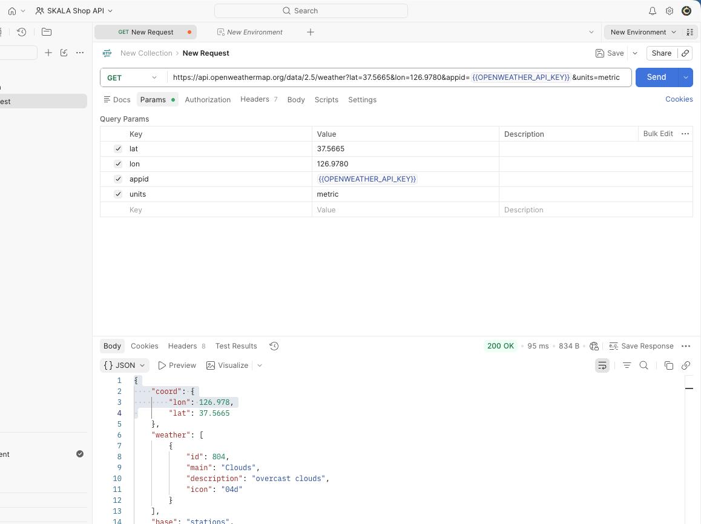

# skala-vue

Vue 3 수업에서 배운 문법을 하나의 날씨 조회 화면에 단계적으로 적용하는 과제 프로젝트입니다.

## 프로젝트 소개

- Vue 3의 Composition API와 `<script setup>`을 사용합니다.
- 배열 렌더링, 조건부 렌더링, 입력 바인딩과 이벤트 수식어를 날씨 목업에 적용합니다.
- `computed`, `watch`, `watchEffect`를 사용해 검색 결과와 전국 날씨 통계를 관리합니다.
- 과제 1의 Weather Mockup을 과제 2의 Weather Composition으로 계속 발전시키는 구조입니다.

## 주요 기능

- 도시별 날씨 카드 반복 출력
- 한글 도시명 검색과 검색 결과 안내
- 기온과 미세먼지 상태별 조건부 문구
- 카드 선택과 상세보기 이벤트 분리
- 전국 평균 기온, 습도와 풍속 계산
- 주요 날씨 통계와 반응형 상태 변화 감시

## 프로젝트 구조

- 날씨 기능 컴포넌트는 `src/components/weather/`, 재사용 가능한 기본 컴포넌트는 `src/components/common/`에서 관리합니다.
- 날씨와 지역 상태는 `src/stores/`에서 관리하고, `/` 경로의 `WeatherHomeView.vue`가 화면 조립과 상세 페이지 이동을 담당합니다.
- 외부 API 요청 함수는 `src/apis/`, API별 Axios 인스턴스와 인터셉터는 `src/utils/`에서 관리합니다.
- `src/App.vue`의 `RouterView`에서 현재 경로에 해당하는 View를 렌더링합니다.
- 날씨 더미 데이터는 `src/data/weatherData.js`에서 별도로 관리합니다.

```text
src/
├── App.vue
├── apis/
│   ├── regionalCode.js
│   └── weather.js
├── assets/
│   ├── base.css
│   ├── main.css
│   └── openweathermap-postman-api-test.png
├── components/
│   ├── common/
│   │   ├── BaseBadge.vue
│   │   ├── BaseButton.vue
│   │   └── BaseInput.vue
│   └── weather/
│       ├── CitySearchPanel.vue
│       ├── CitySelectionStatusPanel.vue
│       ├── DashboardCard.vue
│       ├── InsectConditionBadge.vue
│       ├── NationalWeatherPanel.vue
│       ├── UnitToggler.vue
│       ├── WeatherCard.vue
│       ├── WeatherCardList.vue
│       └── WeatherHeader.vue
├── data/
│   ├── cityData.js
│   ├── insectData.js
│   └── weatherData.js
├── main.js
├── router/
│   └── index.js
├── stores/
│   ├── configStore.js
│   ├── regionStore.js
│   └── weatherStore.js
├── types/
│   ├── insect.js
│   ├── openWeather.js
│   ├── region.js
│   └── weather.js
├── utils/
│   ├── insect.js
│   ├── openWeatherClient.js
│   ├── regionalCodeClient.js
│   └── temperature.js
└── views/
    ├── NotFoundView.vue
    ├── WeatherAboutView.vue
    ├── WeatherDetailView.vue
    ├── WeatherHomeView.vue
    └── WeatherTipsView.vue
```

## 공용 디자인 시스템

과제 3-5의 컴포넌트 기본 디자인을 일관되게 적용하기 위해 파란색을 메인 색상으로 사용합니다. 공용 색상은 `src/assets/main.css`의 `:root`에 CSS 변수로 관리합니다.

### 색상 관리 구조

- `--color-white`, `--color-blue-600`과 같은 기본 팔레트에 실제 색상값을 정의합니다.
- `--color-primary`, `--color-success`와 같은 역할별 색상은 기본 팔레트를 참조합니다.
- 컴포넌트에서는 색상 코드를 직접 작성하지 않고 역할별 CSS 변수를 사용합니다.
- 버튼 그림자는 `--shadow-button-primary`처럼 상태별 공용 변수로 관리합니다.

### 디자인 토큰

- 폰트 크기는 `--font-size-xs`부터 `--font-size-xl`까지 단계별로 관리합니다.
- 글자 굵기는 `--font-weight-regular`부터 `--font-weight-bold`까지 역할에 따라 사용합니다.
- 간격은 4px 배수의 `--space-1`부터 `--space-8`까지 사용합니다.
- 모서리는 `--radius-sm`, `--radius-md`, `--radius-lg`, `--radius-full`로 구분합니다.
- 일반 표면 그림자는 `--shadow-sm`, `--shadow-md`, `--shadow-lg`로 깊이를 구분합니다.

| 역할           | CSS 변수                 | 색상      |
| -------------- | ------------------------ | --------- |
| 메인           | `--color-primary`        | `#2563eb` |
| 메인 호버      | `--color-primary-hover`  | `#1d4ed8` |
| 연한 메인 배경 | `--color-primary-soft`   | `#eff6ff` |
| 전체 배경      | `--color-background`     | `#f4f8fc` |
| 카드 등 표면   | `--color-surface`        | `#ffffff` |
| 기본 글자      | `--color-text-primary`   | `#0f172a` |
| 보조 글자      | `--color-text-secondary` | `#475569` |
| 테두리         | `--color-border`         | `#e2e8f0` |
| 성공·좋음      | `--color-success`        | `#15803d` |
| 주의·보통      | `--color-warning`        | `#b45309` |
| 위험·나쁨      | `--color-danger`         | `#b91c1c` |

- 버튼과 배지 같은 공용 컴포넌트는 `primary`, `success`, `warning`, `danger`처럼 의미에 따라 색상을 구분합니다.
- 반응형 화면에서는 색상의 의미를 유지하고 크기, 간격과 배치만 변경합니다.
- `body`에는 공용 배경색과 기본 글자색을 적용하고 링크에는 메인 색상과 호버 색상을 적용합니다.

### 공용 입력 컴포넌트

- `BaseInput.vue`는 `primary`, `success`, `warning`, `danger` variant를 지원합니다.
- 입력창 크기는 `small`, `medium`, `large`로 구분하며 기본값은 `primary`, `medium`입니다.
- 자주 사용하는 `type`, `value`, `placeholder`는 타입이 확인되는 props로 받고, 나머지 네이티브 속성은 `v-bind="$attrs"`로 전달합니다.
- 검색 입력창은 부모 래퍼가 너비를 담당하고 `BaseInput`은 래퍼 안에서 전체 너비를 사용하며, `input` 이벤트를 부모에 다시 전달합니다.

### 공용 배지 컴포넌트

- `BaseBadge.vue`는 `primary`, `success`, `warning`, `danger` variant와 `small`, `medium`, `large` 크기를 지원합니다.
- pill 형태, 상태 점과 연한 배경으로 짧은 상태 정보를 구분하며 기본값은 `primary`, `medium`입니다.
- 날씨 카드의 현재 날씨와 미세먼지 상태에 적용하고 미세먼지 상태에 따라 성공, 주의, 위험 색상을 표시합니다.

## 실행 방법

### 의존성 설치

```sh
npm install
```

### 개발 서버 실행

```sh
npm run dev
```

### 빌드

```sh
npm run build
```

### 코드 검사

```sh
npm run lint
```

## 배포

- 배포 주소: [https://homework.christmas](https://homework.christmas)
- 기본 Pages 주소: [https://skala-vue.pages.dev](https://skala-vue.pages.dev)
- GitHub 저장소: [https://github.com/pigpgw/skala-vue](https://github.com/pigpgw/skala-vue)
- 배포 서비스: Cloudflare Pages
- 도메인 구매 및 관리: Spaceship, Cloudflare DNS

### 배포 과정

1. GitHub의 `main` 브랜치에 Vue 소스코드를 푸시했습니다.
2. Cloudflare Pages에 GitHub 저장소를 연결했습니다.
3. 빌드 명령은 `npm run build`, 출력 폴더는 `dist`로 설정했습니다.
4. `dist/`는 GitHub에 직접 올리지 않고 Cloudflare Pages가 소스코드를 빌드하도록 구성했습니다.
5. Spaceship에서 구매한 `homework.christmas`의 네임서버를 Cloudflare 네임서버로 변경했습니다.
6. Cloudflare Pages에 사용자 도메인을 등록하여 배포 페이지와 연결했습니다.

## 과제 진행 기록

### 2026-08-19

과제 1과 과제 2의 반응형 날씨 기능은 현재 `/` 경로의 `WeatherHomeView.vue`에서 이어서 사용합니다.

#### 과제 1 - Weather Mockup

1. `[과제 1-1]` 날씨 배열을 `ref()`로 관리하고 `v-for`와 `:key`로 도시별 카드를 출력했습니다.
2. `[과제 1-2]` `v-if`와 `v-else`로 25도 기준의 기온 안내를 표시했습니다.
3. `[과제 1-3]` `:value`와 `@input`으로 입력한 한글 도시명을 화면에 표시했습니다.
4. `[과제 1-4]` 카드 선택 이벤트와 `@click.stop`을 적용한 상세보기 버튼을 구현했습니다.
5. `[과제 1-5]` 제주, 습도, 풍속, 미세먼지, 도시 검색과 최소 테두리를 추가해 목업을 확장했습니다.

#### 과제 2 - Weather Composition

1. `[과제 2-1]` 검색어, 선택 도시와 날씨 배열을 별도의 반응형 상태로 구성했습니다.
2. `[과제 2-2]` `computed`로 검색어와 일치하는 도시를 반환하는 `filteredWeatherList`를 만들었습니다.
3. `[과제 2-3]` `watch`와 `watchEffect`로 선택 문구와 검색어 변화를 콘솔에 기록했습니다.
4. `[과제 2-4]` 검색 결과 유무에 따라 도시 목록이나 결과 없음 문구를 표시했습니다.
5. `[과제 2-5]` 검색 결과 도시 개수를 `computed`로 계산하고 `watch`로 변화를 감시했습니다.
6. `[과제 2-5]` 전국 평균 기온, 습도와 풍속을 `computed`로 계산하고 `watch`로 변화를 감시했습니다.
7. `[과제 2-5]` 미세먼지 나쁨 도시 개수를 `computed`로 계산하고 `watch`로 변화를 감시했습니다.
8. `[과제 2-5]` 가장 덥고 춥고 습하며 풍속이 강한 도시를 `computed`와 `reduce()`로 찾았습니다.
9. `[과제 2-5]` `ref`, `v-model`, `v-show`로 전국 통계 표시 여부를 제어하고 `watch`로 변화를 감시했습니다.
10. `[과제 2-5]` 검색어와 검색 결과 개수를 `computed`로 조합해 검색 상태 문구를 만들고 `watch`로 변화를 감시했습니다.

### 2026-08-20

#### 과제 3 - Hands on: Weather Component Vue Components

- 과제 요구사항: Weather 화면의 기능을 역할별 Vue Component로 분리합니다.
- `[과제 3-1]` `WeatherParent.vue`를 부모 컴포넌트로 분리하고 모든 반응형 데이터와 계산 및 감시 로직을 유지했습니다.
- `[과제 3-2]` `BaseDashboardCard.vue`에 `<slot>`과 공통 박스 디자인을 구성하고 검색 영역과 날씨 리스트 영역에 적용했습니다.
- `[과제 3-3]` `SearchBar.vue`를 분리하고 검색어를 props로 전달받아 표시하며, 입력 시 `update-query` 이벤트로 변경된 검색어를 부모 `WeatherParent.vue`에 전달했습니다.
- `[과제 3-4]` `WeatherCard.vue`를 분리하고 도시 객체를 props로 전달받아 표시하며, 카드 선택 시 `select-card`, 상세보기 버튼 클릭 시 `click-detail` 이벤트를 부모로 전달했습니다.
- `[과제 3-5]` 각 필수 컴포넌트의 기본 디자인을 `<style scoped>`로 분리하고 바깥 여백, 공통 박스, 검색 입력창과 날씨 카드에 필요한 최소 스타일만 적용했습니다.
- `[과제 3-6]` `BaseDashboardCard`의 Slot에 `SearchBar`와 `WeatherCard`를 배치하고, `WeatherParent`에서 props와 emits를 직접 바인딩하는 기본 구조를 적용했습니다.
- `[과제 3-7 추가 컴포넌트]` 이후 날씨 카드의 반복 렌더링과 이벤트 전달을 `WeatherCardList.vue`로 추가 분리하고 기존 기능이 유지되도록 구성했습니다.
- `[과제 3-7 추가 컴포넌트]` 추가로 전국 날씨 통계 영역을 `NationalWeatherSummary.vue`로 분리하고 부모가 계산한 통계를 props로 전달받아 표시하도록 구성했습니다.
- `[과제 3-7 추가 컴포넌트]` 검색 입력과 결과 안내의 추상화 계층을 맞추기 위해 `SearchBar.vue`를 `SearchPanel.vue`로 확장했습니다. 검색어, 결과 개수와 검색 상태를 props로 전달받아 표시하고, 입력 시 `update-query` 이벤트로 변경된 검색어를 부모에 전달하도록 구성했습니다.
- `[과제 3-7 추가 리팩터링]` 전국 통계 보기 체크박스를 해당 책임을 가진 `NationalWeatherSummary.vue`로 이동했습니다. `showNationalSummary` 상태는 부모에 유지하고, 자식은 변경된 체크값을 `update-show-national-summary` 이벤트로 전달하도록 구성했습니다.
- `[과제 3-7 추가 리팩터링]` 검색 영역과 날씨 목록을 각각 `SearchPanel.vue`와 `WeatherCardList.vue`가 직접 담당하도록 변경했습니다. 각 영역의 독립적인 책임과 단순한 컴포넌트 구조가 더 적합하다고 판단해 공통 Slot 래퍼였던 `BaseDashboardCard.vue`를 제거했습니다.
- `[과제 3-7 추가 리팩터링]` 검색, 전국 통계와 날씨 목록 세 영역에 동일한 박스 디자인이 필요해 `BaseDashboardCard.vue`를 공용 Slot 컴포넌트로 다시 적용했습니다. 공통 디자인은 래퍼가 담당하고 내부 컴포넌트는 각 기능에 집중하도록 구성했습니다.
- `[과제 3-7 추가 컴포넌트]` 애플리케이션 제목을 `WeatherHeader.vue`로 분리하고, 전체 화면 골격을 담당하는 `App.vue`에 Header와 `<main>`을 배치했습니다. `WeatherParent.vue`는 검색, 통계와 목록 기능에 집중하도록 변경했으며 표시할 내용이 없는 Footer는 만들지 않았습니다.
- `[과제 3-7 구조 및 네이밍 리팩터링]` 선택 결과 영역을 `CitySelectionStatusPanel.vue`로 분리해 `DashboardCard`를 적용하고, 검색 결과 없음 문구는 목록 상태를 담당하는 `WeatherCardList.vue`로 이동했습니다. 화면과 도메인 역할이 드러나도록 `WeatherParent`를 `WeatherDashboard`, `BaseDashboardCard`를 `DashboardCard`, `SearchPanel`을 `CitySearchPanel`, `NationalWeatherSummary`를 `NationalWeatherPanel`로 변경했으며 상태, props, 함수와 CSS 클래스 이름도 함께 정리했습니다. 과제에서 지정한 이벤트 이름은 유지하고 README 파일 트리를 최종 컴포넌트 구조에 맞게 갱신했습니다.
- `[과제 3-7 코드 스타일 정리]` 함수의 매개변수 타입만 설명하는 짧은 JSDoc은 한 줄 형식으로 통일했습니다. 여러 속성을 설명해야 하는 `WeatherItem` 타입 정의는 가독성을 위해 여러 줄 형식을 유지했습니다.
- `[과제 3-7 임포트 경로 정리]` Vite와 `jsconfig.json`에 설정된 `@` 별칭을 사용해 `App.vue`와 `src/components/weather`의 과제 코드 임포트를 절대 경로로 통일했습니다. 임포트는 외부 패키지와 내부 모듈 사이를 한 줄 띄우고, 같은 그룹 안에서는 이름순으로 정리했습니다.
- `[과제 3-7 코드 구조 정리]` 과제 컴포넌트의 선언 순서를 임포트, props/emits, 원본 반응형 상태, 파생 상태, 이벤트 함수, watch/watchEffect 순으로 통일했습니다. 같은 종류의 선언은 글자 길이가 아니라 데이터 의존 관계와 화면의 검색, 전국 통계, 선택 결과 흐름에 맞춰 배치했습니다.
- `[과제 3-5 보완]` 기본 팔레트, 역할별 색상과 상태별 그림자를 `main.css`의 CSS 변수로 분리해 컴포넌트 디자인의 공통 기준을 구성했습니다.
- `[과제 3-7 추가 공용 컴포넌트]` 반복되는 버튼 디자인을 `src/components/common/BaseButton.vue`로 분리하고 단위 변경과 날씨 상세보기 버튼에 적용했습니다.
  - `variant`는 `primary`, `success`, `warning`, `danger`를 지원합니다.
  - `size`는 `small`, `medium`, `large`를 지원합니다.
  - 기본값은 `variant="primary"`, `size="medium"`입니다.
  - 네이티브 `click` 이벤트를 명시적으로 선언해 부모 컴포넌트에 전달합니다.
  - 호버, 클릭, 키보드 포커스와 비활성 상태 스타일을 제공합니다.
- `[과제 3-5 디자인 토큰 확장]` 폰트 크기, 글자 굵기, 간격, 모서리와 일반 그림자를 전역 CSS 변수로 추가하고 현재 날씨 컴포넌트에 적용했습니다.
- `[과제 3-7 추가 공용 입력 컴포넌트]` `BaseInput.vue`를 별도 공용 컴포넌트로 추가하고 `CitySearchPanel.vue`의 검색 입력창에 적용했습니다.
  - `variant`와 `size`에 따라 공용 색상 및 크기 토큰을 사용합니다.
  - `type`, `value`, `placeholder`를 props로 받고 나머지 네이티브 속성은 `$attrs`로 전달합니다.
  - 검색 입력창의 너비는 부모 래퍼에서 조절하고 `input` 이벤트를 명시적으로 부모에 전달합니다.
- `[과제 3-7 추가 공용 배지 컴포넌트]` `BaseBadge.vue`를 추가하고 날씨 카드의 현재 날씨와 미세먼지 상태 표시에 적용했습니다.
  - `variant`와 `size` 기본값을 제공하고 공용 색상, 폰트, 간격과 모서리 토큰을 사용합니다.
  - 미세먼지 좋음, 보통, 나쁨 상태를 각각 `success`, `warning`, `danger` 색상으로 구분합니다.

### 2026-08-21

#### 과제 4 - Hands on: Weather Router Vue Router

- 진행 상태: 구현 완료

**과제 요구사항**

- [x] `[과제 4-1]` `router/index.js`에 과제 3의 날씨 화면으로 이어지는 라우트를 정의하고, 메인 화면을 제외한 View에 지연 로딩과 Catch-all Route를 적용했습니다.
  - `src/vite-env.d.ts`에서 Vite Client 타입을 불러와 `import.meta.env.BASE_URL`의 타입을 인식하도록 설정했습니다.
- [x] `[과제 4-2]` `App.vue`에 홈과 서비스 소개로 이동하는 `RouterLink` Navigation Bar를 추가하고, 메인 콘텐츠 영역에 현재 경로의 View를 표시하는 `RouterView`를 배치했습니다.
- [x] `[과제 4-3]` 과제 3의 반응형 상태와 화면 조립을 `/` 경로의 `WeatherHomeView.vue`로 이동했습니다.
  - 재사용되지 않으면서 `WeatherHomeView`와 역할이 겹치던 `WeatherDashboard`를 제거해 중간 이벤트 전달 단계를 줄였습니다.
  - 상세보기 버튼의 `window.alert()`를 제거하고 도시 ID를 컴포넌트 이벤트로 전달합니다.
  - `WeatherHomeView`에서 `useRouter()`와 `router.push('/weather/' + id)`를 사용해 상세 페이지로 이동합니다.
  - `WeatherCard`, `WeatherCardList`, `WeatherHomeView`의 템플릿에서 직접 처리하던 이벤트 전달, 상태 변경과 라우터 이동을 역할이 드러나는 함수로 분리해 각 `script` 영역에서 관리합니다.
  - 도시가 추가되더라도 ID가 겹치지 않도록 Mock Data의 도시 ID를 UUID로 구성하고 카드 `key`, 상세 경로와 데이터 조회에 동일하게 사용합니다.
- [x] `[과제 4-4]` `WeatherDetailView.vue`에서 지역별 상세 기상관측 정보를 표시합니다.
  - 과제 3부터 사용한 공용 `weatherData`를 Mock Data로 활용합니다.
  - 동적 경로의 `cityId`를 기준으로 Mount 시점에 Mock Data에서 도시 객체를 선택합니다.
- [x] `[과제 4-5]` `WeatherAboutView.vue`에 날씨 서비스의 주요 기능을 소개하고 `RouterLink`로 메인 대시보드에 돌아가는 기능을 작성했습니다.
- [x] `[과제 4-6]` `WeatherTipsView.vue`를 추가하고 `/tips` 경로와 Navigation Bar를 연결해 날씨별 생활 수칙을 안내하도록 구성했습니다.
- `[과제 4-2 반응형 내비게이션 보완]` 작은 화면에서 내비게이션 링크와 단위 변경 버튼 문구가 두 줄로 나뉘지 않도록 한 줄 표시를 적용했습니다.
  - 내비게이션 전역 레이아웃은 `main.css`에서 관리하며 화면 너비보다 길어지면 항목을 축소하거나 줄바꿈하지 않고 가로로 스크롤할 수 있도록 구성했습니다.

#### 과제 5 - Hands on: Weather Store Pinia

- 진행 상태: 구현 완료

**과제 요구사항**

- [x] `[과제 5-0]` `stores/configStore.js`에 날씨 단위 설정 Store를 작성했습니다.
  - `state`의 `unit`에 현재 단위를 저장하고 초기값은 `celsius`로 설정합니다.
  - `getters`의 `unitSymbol`에서 현재 단위에 맞는 기호인 `℃` 또는 `℉`를 반환합니다.
  - `actions`의 `toggleUnit`에서 `celsius`와 `fahrenheit`를 전환합니다.
- [x] `[과제 5-1]` 현재 단위와 단위 기호를 표시하고 `toggleUnit`을 실행하는 버튼 영역을 `UnitToggler.vue`로 작성했습니다.
- [x] `[과제 5-2]` `UnitToggler.vue`를 `App.vue`의 Navigation Bar 옆에 배치했습니다.
- [x] `[과제 5-3]` 메인 날씨 카드와 전국 통계, 상세 날씨에 단위 설정 변경을 적용했습니다.
  - 원본 기온 데이터는 섭씨 숫자로 유지합니다.
  - 현재 단위가 `fahrenheit`이면 `(섭씨 × 9) / 5 + 32`를 계산하고 반올림해 표시합니다.
  - 현재 단위에 맞는 `unitSymbol`을 기온 값과 함께 표시합니다.
- [x] `[과제 5-4 추가 Store 작성 및 활용]` 과제의 추가 Store 요구사항을 충족하기 위해 `weatherStore.js`를 직접 작성하고 메인·상세 화면에서 실제로 활용했습니다.
  - `state` 역할의 `weatherList`에 메인과 상세 화면이 공유하는 날씨 데이터를 저장했습니다.
  - `action` 역할의 `addWeatherItem`으로 새 날씨 데이터를 추가하고 `findWeatherById`로 도시 ID에 해당하는 날씨를 조회하도록 구성했습니다.
  - `WeatherHomeView.vue`에서는 `storeToRefs`로 `weatherList`의 반응성을 유지하면서 카드 목록과 전국 통계에 사용했습니다.
  - `WeatherDetailView.vue`에서는 `findWeatherById`를 호출해 동적 경로의 도시 ID에 해당하는 상세 날씨를 조회했습니다.
  - 검색어와 필터링은 메인 화면에서만 사용하므로 전역 Store로 이동하지 않고 `WeatherHomeView.vue`의 지역 상태와 계산된 값으로 유지했습니다.
- `[과제 5-3 온도 변환 리팩터링]` 컴포넌트마다 중복된 섭씨·화씨 변환 공식을 `src/utils/temperature.js`의 순수 함수로 분리했습니다.
  - `WeatherCard`, `NationalWeatherPanel`, `WeatherDetailView`에서 온도와 현재 단위를 인자로 전달해 동일한 변환 함수를 사용합니다.
  - 단위 Store를 utils에서 직접 참조하지 않아 변환 함수를 독립적으로 재사용하고 검증할 수 있도록 구성했습니다.
- `[과제 5-4 공용 타입 리팩터링]` 세 파일에 중복 선언된 `WeatherItem` JSDoc 타입을 `src/types/weather.js`로 분리했습니다.
  - `weatherStore`, `WeatherCard`, `WeatherCardList`가 하나의 날씨 데이터 구조를 참조하도록 통일했습니다.
  - README 파일 트리에 공용 컴포넌트, 타입과 utils 디렉터리를 반영했습니다.
- `[과제 5-4 날씨별 벌레 정보 확장]` 날씨 Mock Data에 도시별 `insects` 목록을 추가하고 날씨 카드와 상세 화면에서 자주 출몰하는 벌레를 표시했습니다.
  - 모기, 러브버그, 초파리, 매미, 잠자리, 나방과 쯔쯔가무시를 매개하는 털진드기 정보를 포함합니다.
  - 벌레 목록은 공용 `BaseBadge`로 표시하고 털진드기 주의 정보는 `danger`, 나머지는 `warning` 색상으로 구분합니다.
  - 두 화면에서 사용하는 벌레 위험도 판별은 `src/utils/insect.js`의 공용 함수로 분리했습니다.
- `[과제 5-4 벌레 정보 구조 및 안내 기능 확장]` `insects`를 문자열 배열에서 `id`, `name`, `condition`, `sideEffects`를 가진 객체 배열로 변경했습니다.
  - 공용 벌레 정보는 `insectData.js`, 타입은 `types/insect.js`에서 관리해 새 벌레를 한 곳에서 쉽게 추가할 수 있도록 구성했습니다.
  - `InsectConditionBadge.vue`를 추가해 벌레 배지에 마우스를 올리거나 키보드로 포커스하면 출몰 조건과 영향을 확인할 수 있도록 했습니다.

#### 공통 프로젝트 정리

- `[과제 제출 파일 구조 정리]` 현재 과제에서 사용하는 파일만 남기고 Vue 기본 예제, 수업 연습본, 자동 생성본과 단계별 백업 파일을 제거했습니다.
  - `tasks` 폴더를 없애고 기능 컴포넌트는 `components/weather`, 공용 Base 컴포넌트는 `components/common`으로 역할에 맞게 분리했습니다.
  - 실행에 필요한 프로젝트 설정과 날씨 View, 데이터, Store, 타입 및 utils 구조는 그대로 유지했습니다.

#### 과제 6 - Hands on: Weather Axios

- 진행 상태: 구현 진행 중 (`6-1`, `6-3` 완료)

**Axios 활용 준비**

- [x] `[과제 6-0]` Axios 라이브러리를 설치했습니다.
- [x] OpenWeatherMap에 가입하고 API Key를 발급받았습니다.
- [x] API Key가 커밋되지 않도록 `.env`를 `.gitignore`에 추가했습니다.
- [x] OpenWeatherMap 전용 Axios 인스턴스와 요청·응답 인터셉터를 구성했습니다.
- [x] 위도·경도 및 도시명 기반 현재 날씨 조회 함수를 준비했습니다.
- [x] `[과제 6-3 준비]` 국토교통부 지역코드 API 전용 Axios 인스턴스와 요청·응답 인터셉터를 구성했습니다.
- [x] `[과제 6-3 준비]` 페이지와 시도 코드를 전달할 수 있는 지역코드 조회 함수를 API 모듈로 분리했습니다.
- [x] `[과제 6-3 준비]` 지역코드 원본 응답과 검색용 지역 객체의 JSDoc 타입을 분리했습니다.
- [x] `[과제 6-3 준비]` `regionStore`에서 지역 목록을 관리하고 시군구 코드 기준으로 중복을 제거했습니다.
- [x] `[과제 6-3 준비]` `CitySearchPanel`에 지역 검색 결과 목록과 지역 선택 이벤트를 추가했습니다.
- [x] `[과제 6-3]` `WeatherHomeView`에서 지역 데이터를 조회하고 입력한 지역명과 일치하는 검색 후보를 최대 10개까지 표시했습니다.
- [x] `[과제 6-3 UI 보완]` 지역 검색 결과를 공용 `BaseButton` 세로 목록으로 표시하고, 전체 화면은 좁은 단일 칼럼으로 구성해 입력창과 결과 목록을 카드 왼쪽 기준선에 정렬했습니다.
- [x] `[과제 6-1 준비]` 메인에 표시할 서울·수원·부산·제주의 이름과 위도·경도를 `cityData.js`에 분리했습니다.
- [x] `[과제 6-1 준비]` OpenWeatherMap 현재 날씨 응답 구조를 공용 JSDoc 타입으로 분리하고 날씨 조회 함수의 반환 타입에 적용했습니다.
- [x] `[과제 6-1 준비]` `weatherStore`에서 기본 도시의 현재 날씨를 병렬 조회하고 기존 카드 데이터 구조로 변환하는 비동기 액션을 작성했습니다.
- [x] `[과제 6-1]` 메인 화면 Mount 시 서울·수원·부산·제주의 현재 날씨를 조회해 카드와 전국 통계의 기온, 날씨 상태, 습도와 풍속에 실제 API 데이터를 적용했습니다.
- [x] `[과제 6-3 보완]` 지역 검색 후보를 선택하면 해당 지역의 실제 날씨를 카드로 추가하고, 같은 지역을 다시 선택하면 중복 없이 갱신하도록 연결했습니다. 아직 조회하지 않은 미세먼지와 벌레 정보는 준비 중 상태로 표시합니다.

- [x] `[추가 구현]` Postman으로 OpenWeatherMap API를 테스트해 `200 OK` 응답을 확인했습니다.



**기타 외부 API: 국토교통부 지역코드**

- [x] `[과제 6-3]` [국토교통부 지역코드 OpenAPI](https://www.data.go.kr/data/15142029/openapi.do)를 연동해 시군구 검색 후보를 표시하고 선택 이벤트를 연결했습니다.

**과제 요구사항**

- [x] `[과제 6-1]` OpenWeatherMap API를 통해 실제 날씨 데이터를 가져와 애플리케이션에 적용합니다.
- [ ] `[과제 6-2]` OpenWeatherMap에서 제공하는 추가 API를 연동해 애플리케이션 기능을 확장합니다.
- [x] `[과제 6-3]` 국토교통부 지역코드 OpenAPI를 추가로 연동해 조회된 시군구의 검색 기능을 확장했습니다.

### 트러블슈팅 기록

과제 번호순이 아닌 문제가 발생한 시간순으로 기록하며, 각 항목에 관련 과제 번호를 함께 표시합니다.

1. `[과제 6]` 비동기 API 호출을 추가하면서 Setup Store 정의 자체에 `async`를 붙여 `storeToRefs()`에서 `weatherList`를 찾지 못하는 문제가 발생했습니다. Store는 동기적으로 생성하고 API 호출만 비동기 액션으로 분리했으며, 지역 상태와 조회 책임은 `regionStore`로 옮겼습니다.

2. `[과제 6]` 공공데이터포털의 Encoding 인증키를 Axios `params`로 전달하면서 키가 이중 인코딩되어 `403 Forbidden`이 발생했습니다. 환경변수의 인증키를 `decodeURIComponent()`로 한 번 디코딩한 뒤 Axios가 요청 과정에서 한 번만 인코딩하도록 수정했습니다.

3. `[과제 6]` 국토교통부 지역코드 API로 전국 시군구 검색 목록을 구성하려 했지만, 응답이 읍면동 단위의 총 50,077건으로 제공되어 전체 조회 시 앱을 실행할 때마다 최대 1,000건씩 약 51회 호출해야 하는 문제가 있었습니다. 과제 단계에서는 첫 페이지 100건을 활용해 지역 검색과 날씨 조회 흐름을 우선 구현하고, 이후 시군구 전용 API 또는 정적 지역 목록으로 보완하기로 했습니다.

### 과제 요구사항 대비 변경 사항

각 과제의 기본 요구사항을 기준으로, 이후 과제와 보완 작업을 거치며 달라진 구조와 구현 방식을 정리합니다. 새로운 기능이나 구조 변경이 발생하면 현재 코드 기준으로 이 내용을 갱신합니다.

#### 과제 1 변경 사항

| 과제 1 요구사항                                  | 현재 구현                                                                       | 변경 내용 및 이유                                                                                        |
| ------------------------------------------------ | ------------------------------------------------------------------------------- | -------------------------------------------------------------------------------------------------------- |
| 컴포넌트 내부의 날씨 배열을 `ref()`로 관리       | `weatherData.js`를 초기 데이터로 사용하고 `weatherStore`의 `weatherList`로 관리 | 메인 화면과 상세 화면이 같은 날씨 목록을 공유하고 새 도시 추가 기능도 한 곳에서 처리하도록 변경했습니다. |
| 한 화면에서 검색, 통계와 카드 목록을 직접 렌더링 | `WeatherHomeView`가 상태를 관리하고 `components/weather`의 기능 컴포넌트를 조립 | 과제 1의 기능은 유지하면서 검색, 통계, 목록과 선택 상태의 화면 책임을 분리했습니다.                      |
| 상세보기 버튼에서 단순 이벤트 처리               | `/weather/:cityId` 동적 Route로 이동                                            | 도시 ID를 기준으로 `WeatherDetailView`에서 상세 날씨와 벌레 정보를 표시하도록 확장했습니다.              |

#### 과제 2 변경 사항

| 과제 2 요구사항                                         | 현재 구현                                                                             | 변경 내용 및 이유                                                                                                 |
| ------------------------------------------------------- | ------------------------------------------------------------------------------------- | ----------------------------------------------------------------------------------------------------------------- |
| 검색어와 날씨 목록을 지역 반응형 상태로 관리            | 검색어는 `WeatherHomeView`의 지역 상태, 날씨 목록은 `weatherStore`의 전역 상태로 관리 | 한 화면에서만 사용하는 검색 상태는 지역 상태로 유지하고 여러 Route가 공유하는 날씨 데이터만 Store로 이동했습니다. |
| `computed`, `watch`, `watchEffect`를 한 컴포넌트에 작성 | 계산과 감시 로직은 `WeatherHomeView`, 출력 UI는 하위 컴포넌트가 담당                  | 반응형 학습 요구사항은 유지하면서 데이터 처리와 화면 출력의 책임을 분리했습니다.                                  |
| 검색 결과와 전국 통계를 같은 템플릿에서 표시            | `CitySearchPanel`, `NationalWeatherPanel`, `WeatherCardList`로 분리                   | props와 emits를 사용해 과제 2의 반응형 결과를 역할별 컴포넌트에 전달합니다.                                       |

#### 과제 3 변경 사항

| 과제 3 요구사항                     | 현재 구현                                    | 변경 내용 및 이유                                                                                                                                                                                           |
| ----------------------------------- | -------------------------------------------- | ----------------------------------------------------------------------------------------------------------------------------------------------------------------------------------------------------------- |
| `WeatherParent.vue`                 | `WeatherHomeView.vue`                        | Router를 적용하면서 `/` 경로의 View가 화면 상태와 조립을 담당하도록 변경했습니다. 역할이 겹치던 중간 컴포넌트는 제거하고 기존 `ref`, `computed`, `watch`, `watchEffect`를 `WeatherHomeView`로 이동했습니다. |
| `BaseDashboardCard.vue`             | `DashboardCard.vue`                          | 특정 상속 구조로 오해할 수 있는 `Base`를 제거하고 공통 대시보드 박스라는 역할을 표현했습니다. `<slot>`과 공통 박스 스타일은 그대로 유지합니다.                                                              |
| `SearchBar.vue`                     | `CitySearchPanel.vue`                        | 검색 입력뿐 아니라 검색 결과 개수와 상태 문구도 표시하므로 실제 책임을 나타내는 `Panel` 이름을 사용합니다. 검색값은 props로 받고 `update-query` 이벤트로 부모에 전달합니다.                                 |
| `WeatherCard`를 Slot에 직접 배치    | `DashboardCard` 안에 `WeatherCardList` 배치  | 반복 렌더링과 빈 결과 처리를 `WeatherCardList`가 담당하고, 개별 `WeatherCard`의 이벤트를 `WeatherHomeView`까지 전달하도록 책임을 분리했습니다.                                                              |
| 필수 컴포넌트 4개                   | 날씨 컴포넌트 9개와 공용 Base 컴포넌트 3개   | 검색, 통계, 선택 상태, 단위 전환과 벌레 안내를 각각 분리했습니다. 날씨 기능은 `components/weather`, 재사용 UI는 `components/common`에서 관리합니다.                                                         |
| 각 컴포넌트의 `<style scoped>` 분리 | 컴포넌트 전용 스타일과 전역 디자인 토큰 분리 | 개별 레이아웃은 `<style scoped>`에서 관리하고 색상, 폰트, 간격, 모서리와 그림자는 `main.css`의 전역 토큰을 사용합니다.                                                                                      |

#### 과제 4 변경 사항

| 과제 4 요구사항                       | 현재 구현                                                                   | 변경 내용 및 이유                                                                                          |
| ------------------------------------- | --------------------------------------------------------------------------- | ---------------------------------------------------------------------------------------------------------- |
| 홈, 소개, 상세와 Catch-all Route 구성 | 기존 Route에 날씨 생활 팁 Route를 추가하고 View를 지연 로딩                 | 기본 Router 요구사항을 유지하면서 별도의 생활 수칙 화면을 추가했습니다.                                    |
| `RouterLink` 중심의 Navigation Bar    | Navigation Bar 옆에 `UnitToggler`를 배치하고 전역 CSS에서 한 줄 표시를 관리 | Route 이동과 단위 변경을 한 영역에서 제공하며, 화면이 좁아져도 링크 문구가 줄바꿈되지 않도록 보완했습니다. |
| Mock Data에서 상세 도시 조회          | `weatherStore.findWeatherById()`로 상세 도시 조회                           | 메인 화면과 상세 Route가 동일한 Store 데이터를 사용하도록 조회 경로를 통일했습니다.                        |
| 기본 날씨 상세 정보 표시              | 상세 날씨와 함께 벌레 목록, 출몰 조건과 영향을 표시                         | `InsectConditionBadge`를 사용해 마우스 호버와 키보드 포커스로 추가 정보를 확인하도록 확장했습니다.         |

#### 과제 5 변경 사항

| 과제 5 요구사항                  | 현재 구현                                                     | 변경 내용 및 이유                                                                                              |
| -------------------------------- | ------------------------------------------------------------- | -------------------------------------------------------------------------------------------------------------- |
| 단위 설정용 `configStore` 작성   | `configStore`와 날씨 데이터용 `weatherStore`를 분리해 사용    | 단위 설정과 날씨 목록의 변경 책임이 다르므로 Store를 역할별로 분리했습니다.                                    |
| 컴포넌트에서 섭씨·화씨 변환      | `utils/temperature.js`의 `convertTemperature()`를 공통 사용   | 카드, 전국 통계와 상세 화면의 중복 변환 공식을 하나의 순수 함수로 통일했습니다.                                |
| 컴포넌트별 날씨 데이터 구조 사용 | `types/weather.js`와 `types/insect.js`의 공용 JSDoc 타입 참조 | Store, 데이터와 컴포넌트가 같은 속성 구조를 사용하도록 타입 정의를 한 곳에서 관리합니다.                       |
| 날씨 정보 중심의 Store 데이터    | 각 날씨 객체가 공용 벌레 정보 객체 배열을 참조                | `insectData.js`에서 벌레 ID, 이름, 출몰 조건과 영향을 관리해 새로운 벌레를 쉽게 추가할 수 있도록 확장했습니다. |

#### 과제 6 변경 사항

| 과제 6 요구사항                      | 현재 구현                                                                 | 변경 내용 및 이유                                                                                                  |
| ------------------------------------ | ------------------------------------------------------------------------- | ----------------------------------------------------------------------------------------------------------------- |
| OpenWeatherMap 실제 날씨 데이터 적용 | 기본 네 도시를 병렬 조회해 메인 카드와 전국 통계에 현재 날씨를 적용       | 기온, 날씨 상태, 습도와 풍속은 API 응답을 사용하며 미세먼지와 벌레 정보는 후속 기능을 적용하기 전까지 기존 데이터를 임시로 유지합니다. |
| OpenWeatherMap 추가 API 연동          | 추가 API 선정 및 연동 전                                                  | 도시 좌표 변환이나 대기질 기능을 후속 구현해 과제 6-2를 확장할 예정입니다.                                         |
| 기타 외부 API 연동                    | 국토교통부 지역코드 OpenAPI의 검색 후보를 선택해 실제 날씨 카드를 추가·갱신 | 전체 50,077건 조회의 호출 부담을 확인해 첫 페이지 데이터를 우선 활용하고, 시군구 전용 데이터로 교체할 여지를 남겼습니다. |

## 커밋 컨벤션

커밋 메시지는 [Conventional Commits](https://www.conventionalcommits.org/ko/v1.0.0/) 규칙을 따릅니다.

```text
type: [과제 n-n] 한글 제목

한글 본문
```

- `type`은 영어 소문자로 작성합니다.
- 과제 커밋 제목에는 작업 단계에 맞는 `[과제 n-n]`을 표시합니다.
- 제목과 본문은 한글로 작성합니다.
- 본문은 제목 다음에 한 줄을 비우고 작성합니다.

### 사용하는 타입

| 타입       | 설명                              |
| ---------- | --------------------------------- |
| `feat`     | 새로운 기능 추가                  |
| `fix`      | 버그 수정                         |
| `docs`     | 문서 수정                         |
| `style`    | 코드 동작에 영향이 없는 형식 수정 |
| `refactor` | 기능 변경 없이 코드 구조 개선     |
| `test`     | 테스트 코드 추가 또는 수정        |
| `chore`    | 빌드, 설정, 패키지 등 기타 작업   |

### 예시

```text
feat: [과제 3-3] 도시 검색 컴포넌트를 분리

검색어를 props로 전달받고 update-query 이벤트로 부모에 전달하도록 구성했습니다.
```
